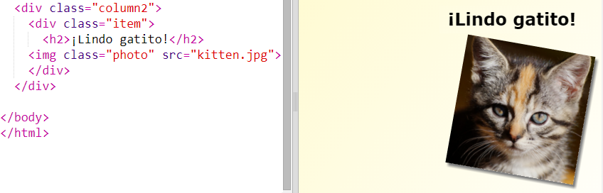
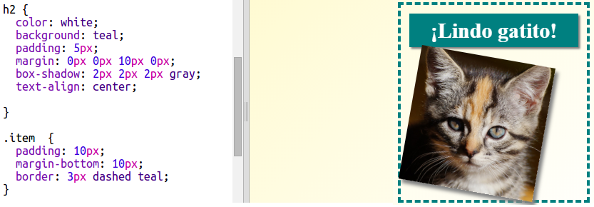

## Style magazine items

Let's make the layout a bit more interesting.

+ Add a `div` around your image with a `class` and add a `h2` heading:
    
    

+ Now style the item and heading.
    
    Here's an example, but you can make changes:
    
    