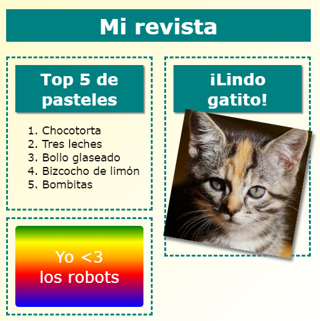

\--- challenge \---

## Desafío: Añade objetos en la columna izquierda

¿Puedes añadir una lista ordenada y una pegatina con fondo de gradiente y texto en la columna izquierda?

Aquí tienes un ejemplo:

Este es el código para el ejemplo, pero puedes cambiarlo o crear tu propio código.

HTML:

CSS:

\--- /challenge \---