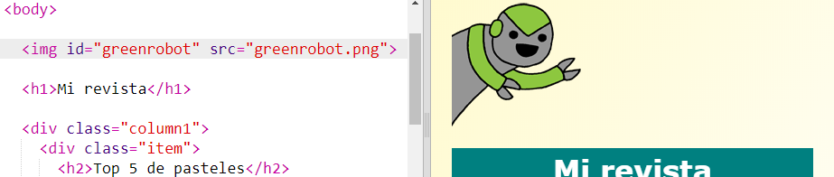

## Incluir una animación

Vamos a añadir una animación divertida a tu revista.

+ Abre `index.html` e incluye la imagen `greenrobot.png` en la parte superior de tu página.

+ Ahora añade el CSS para animar tu robot:

