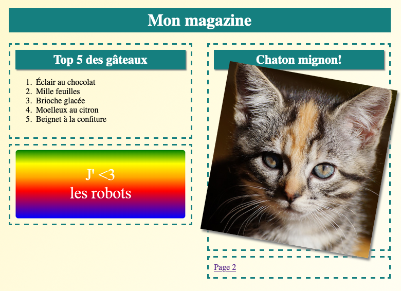

## Introduction

Dans ce projet, tu apprendras à utiliser HTML et CSS pour créer un magazine en ligne à plusieurs pages avec un agencement à deux colonnes. Tu reverras également beaucoup de techniques HTML et CSS apprises dans d’autres projets.

  <iframe src="https://trinket.io/embed/html/a41e4e1c5c?outputOnly=true&start=result" width="600" height="505" frameborder="0" marginwidth="0" marginheight="0" allowfullscreen>
  </iframe>
  

### Informations complémentaires pour les responsables de club

Si vous avez besoin d'imprimer ce projet, merci d'utiliser la [version imprimable](https://projects.raspberrypi.org/en/projects/magazine/print).

## \--- collapse \---

## title: Notes pour le responsable de club

## Introduction

Dans ce projet, les enfants apprendront à créer un agencement à deux colonnes. Ils reverront aussi beaucoup d'HTML & CSS appris lors de projets précédents.

## Ressources en ligne

Nous recommandons d'utiliser [trinket](https://trinket.io/) pour écrire du HTML & CSS en ligne. Ce projet contient les trinkets suivants :

* [Point de départ « Magazine » -- jumpto.cc/web-magazine](http://jumpto.cc/web-magazine)

Les enfants peuvent également utiliser ce trinket vide [(jumpto.cc/html-blank)](http://jumpto.cc/html-blank) pour écrire leur propre code HTML & CSS, ou utiliser ce trinket modèle [(jumpto.cc/html-template)](http://jumpto.cc/html-template).

Il y a aussi un Trinket contenant un exemple de solution pour les défis :

* [« Magazine » terminé -- trinket.io/html/a41e4e1c5c](https://trinket.io/html/a41e4e1c5c)

## Ressources hors-ligne

Ce projet peut être [terminé hors-ligne](https://www.codeclubprojects.org/en-GB/resources/webdev-working-offline/) si désiré. Vous pouvez accéder aux ressources du projet en cliquant sur le lien « Matériaux du projet ». Ce lien contient une section « Ressources du projet » qui inclut les ressources dont les enfants auront besoin pour compléter le projet hors-ligne. Assurez-vous que les enfants ont accès à une copie de ces ressources. Cette section inclut les fichiers suivants :

* intro/index.html
* template/template.html
* template/style.css
* magazine/index.html
* magazine/style.css
* magazine/script.js
* magazine/multiple image .png

Vous pouvez aussi trouver une version terminée du projet dans la section « Ressources du bénévole » qui contient :

* magazine-finished/index.html
* magazine-finished/style.css
* magazine-finished/script.js
* magazine-finished/kitten.jpg
* magazine-finished/recipe-finished.jpg
* magazine-finished/greenrobot.png
* magazine-finished/spacerobot.png

(Toutes les ressources ci-dessus peuvent aussi être téléchargées dans les fichiers`.zip` projet et bénévole)

## Objectifs d'apprentissage

* Ce projet enseigne aux enfants comment créer une mise en page de style magazine sur deux colonnes en utilisant `float:`. Il reprend également une grande partie du HTML & CSS qui sont abordés plus en détail dans d'autres projets. Des exemples sont donnés pour que les enfants puissent terminer ce projet même s'ils n'ont pas terminé certains des projets antérieurs. 

Ce projet couvre les éléments suivants du [Programme Raspberry Pi de Créativité Numérique](http://rpf.io/curriculum) :

* [Concevoir des éléments de base en 2D et 3D](https://www.raspberrypi.org/curriculum/design/creator).

## Défis

* « Ajouter des éléments à la colonne de gauche » - placer des éléments à l'intérieur d'un élément flottant ;
* « Ajouter un lien vers la première page » - créer des liens entre les pages d'un projet ;
* « Remplir ta deuxième page » - récapitulatif sur HTML & CSS ;
* « Ajouter une autre animation » - récapitulatif sur les animations.

\--- /collapse \---

## \--- collapse \---

## title: Matériel pour le projet

## Ressources pour le projet

* [Fichier .zip contenant toutes les ressources du projet](https://rpf.io/p/en/magazine-go)
* [Trinket en ligne contenant toutes les ressources du projet « Magazine »](http://jumpto.cc/web-magazine)
* [Modèle de Trinket en ligne](http://jumpto.cc/trinket-template)
* [Trinket vierge](http://jumpto.cc/trinket-blank)
* [template/index.html](resources/template-index.html)
* [template/style.css](resources/template-style.css)
* [intro/index.html](resources/intro-index.html)
* [intro/style.css](resources/intro-style.css)
* [magazine/index.html](resources/magazine-index.html)
* [magazine/style.css](resources/magazine-style.css)
* [magazine/script.js](resources/magazine-script.js)
* [magazine/kitten.jpg](resources/magazine-kitten.jpg)
* [magazine/recipe-final.png](resources/magazine-recipe-final.png)
* [magazine/greenrobot.png](resources/magazine-greenrobot.png)
* [magazine/firerobot.png](resources/magazine-firerobot.png)
* [magazine/spacerobot.png](resources/magazine-spacerobot.png)
* [magazine/dogrobot.png](resources/magazine-dogrobot.png)

## Ressources pour le responsable de club

* [Fichier .zip contenant toutes les ressources du projet terminé](https://rpf.io/p/en/magazine-go)
* [Projet Trinket en ligne terminé](https://trinket.io/html/a41e4e1c5c)
* [magazine-finished/index.html](resources/magazine-finished-index.html)
* [magazine-finished/style.css](resources/magazine-finished-style.css)
* [magazine-finished/script.js](resources/magazine-finished-script.js)
* [magazine-finished/kitten.jpg](resources/magazine-finished-kitten.jpg)
* [magazine-finished/recipe-final.png](resources/magazine-finished-recipe-final.png)
* [magazine-finished/greenrobot.png](resources/magazine-finished-greenrobot.png)
* [magazine-finished/spacerobot.png](resources/magazine-finished-spacerobot.png)

\--- /collapse \---