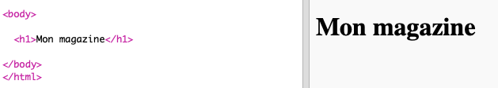
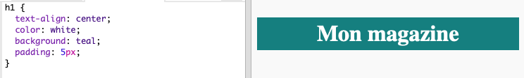
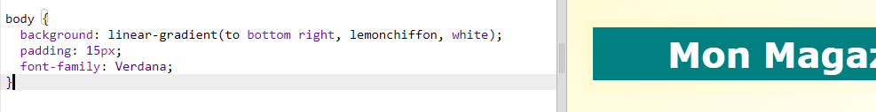

## En-tête et arrière-plan

Les sites Web de type magazine contiennent souvent beaucoup de petits articles sur une page. Dans un premier temps, tu vas créer un titre et un arrière-plan pour ton magazine.

+ Ouvre ce trinket : <a href="http://jumpto.cc/web-magazine" target="_blank">jumpto.cc/web-magazine</a>.
    
    Le projet devrait ressembler à ceci:
    
    

+ Ajoutons un en-tête.
    
    Tu peux réfléchir à un meilleur titre pour ton magazine.
    
    

+ Peux-tu styliser le titre?
    
    Voici un exemple, mais tu peux choisir ton propre style:
    
    

+ Maintenant, créons un arrière-plan intéressant en utilisant un dégradé et choisissons une police pour le magazine.
    
    Voici un exemple de style pour te rappeler comment créer un dégradé:
    
    