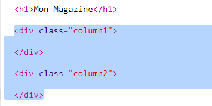
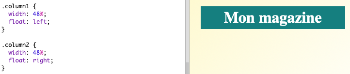
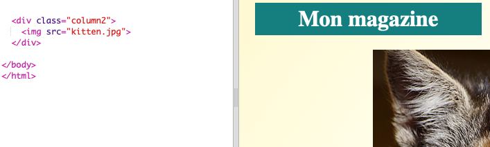
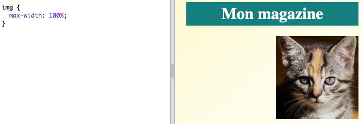

## Créer des colonnes

Les sites Web utilisent souvent plusieurs colonnes. Créons une mise en page sur deux colonnes pour ton magazine.

+ Commençons pas créer deux `div`s pour les colonnes.
    
    Ajoute le code HTML en surbrillance à `index.html` :
    
    

+ Maintenant, stylise les « divs » des colonnes de façon à ce que l'un flotte à gauche et l'autre à droite.
    
    
    
    Chaque colonne est inférieure à 50%, il y a donc de la place pour les remplissages.
    
    Tu auras besoin d'ajouter quelque chose à une colonne pour voir l'effet.

+ Ajoutons une image de chaton en haut de la seconde colonne.
    
    
    
    Remarque que l'image du chaton est positionnée à peu près au milieu de la page, dans la deuxième colonne.
    
    Mais c'est un peu gros !

+ Utilisons `max-width:` pour faire tenir les images dans leur conteneur.
    
    Ajoute le style suivant à `style.css`.
    
    
    
    Cela s'applique à toutes les images que tu utilises dans ton magazine, et pas seulement au chaton.

+ Ajoutons maintenant une classe `photo` à l'image pour pouvoir la styliser :
    
    

+ Et stylisons l'image pour ajouter une ombre et une déformation pour faire ressortir la photo de la page :
    
    
    
    Fais quelques changements jusqu'à ce que tu sois satisfait du résultat.