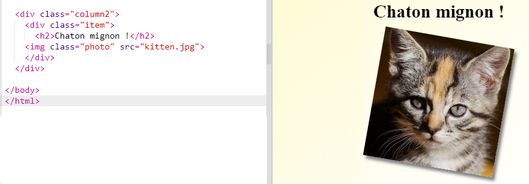
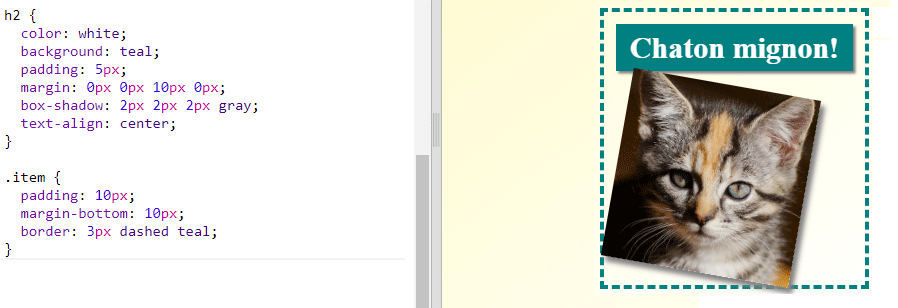

## Styliser les éléments du magazine

Rendons la mise en page un peu plus intéressante.

+ Ajouter un `div` autour de ton image avec une `classe` et ajoute un en-tête `h2` :
    
    

+ Maintenant, stylise l'élément et l'en-tête.
    
    Voici un exemple, mais tu peux apporter des modifications :
    
    