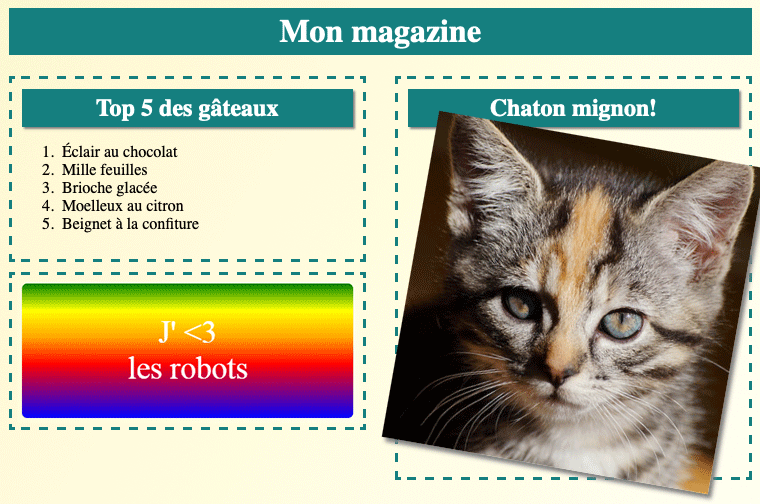

--- challenge ---

## Défi : Ajouter des éléments à la colonne de gauche

Peux-tu ajouter une liste ordonnée et un autocollant de texte dégradé dans la colonne de gauche ?

Voici un exemple :

Il s'agit du code de l'exemple, mais tu peux le modifier ou proposer le tient.

HTML:

CSS:

--- /challenge ---