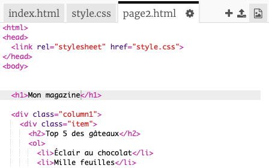
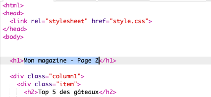
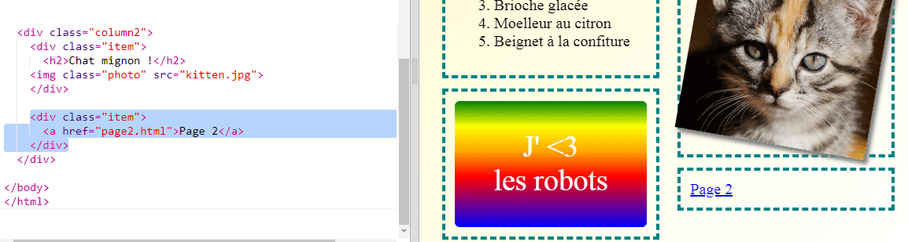

## Ajouter une seconde page

Ajoutons une autre page à ton site Web magazine.

+ Ajoute une nouvelle page à ton projet et nomme-la `page2.html` :

+ La page 2 sera assez similaire à la première page de ton magazine donc tu peux copier le code html de `index.html` et colle-le dans `page2.html`.

Note que les deux pages utilisent le même `style.css` afin qu'ils partagent des styles.

+ Change le titre de la `<h1>`page2</0> :

+ Maintenant, tu auras besoin de liens entre tes pages pour accéder à la page 2 et revenir à la page d'accueil.

Retourne à `index.html`. Ajoute un lien à l'intérieur d'un div dans la colonne 2 dans `index.html` :

+ Teste que tu peux cliquer sur ton nouveau lien et passer à la page 2 de ton magazine.