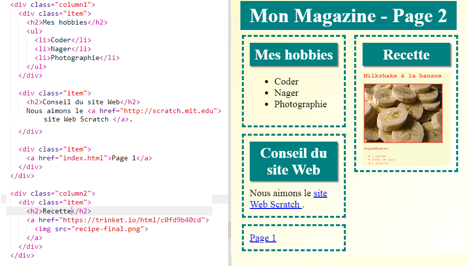

--- challenge ---

## Défi : Remplir ta seconde page

Voici le code des exemples, mais tu peux changer le `div`s ou utiliser tes propres idées.

Clique sur l'icône d'images pour voir les images que tu peux utiliser :

N'oublie pas que tu peux télécharger tes propres images. Assure-toi que tu es autorisé à utiliser les images que tu télécharges.

--- /challenge ---