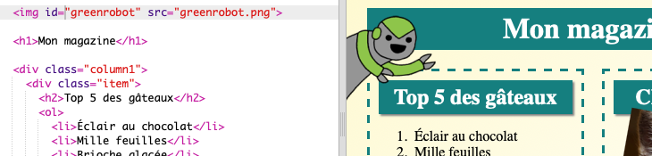
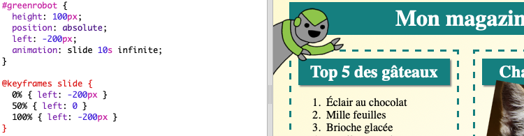

## Ajouter une animation

Ajoutons une animation amusante à ton magazine.

+ Accède à `index.html` et ajoute l'image `greenrobot.png` en haut de ta page.

+ Ajoute maintenant le CSS pour animer ton robot:

