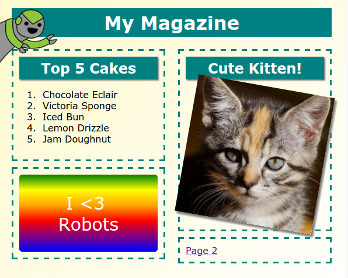

## परिचय

इस प्रोजेक्ट में, आप HTML और CSS के द्वारा सीखेंगे कि दो पेज लेआउट के साथ एक मल्टीपेज मैगज़ीन वेबसाइट कैसे बनाई जाती है । आप अन्य प्रोजेक्ट्स से भी बहुत सारे HTML और CSS तकनीकों को फिर से देखेंगे।

  <iframe src="https://trinket.io/embed/html/a41e4e1c5c?outputOnly=true&start=result" width="600" height="505" frameborder="0" marginwidth="0" marginheight="0" allowfullscreen>
  </iframe>
  

### क्लब लीडरों के लिए अतिरिक्त जानकारी

यदि आप इस प्रोजेक्ट को प्रिंट करना चाहते हैं, तो कृपया [प्रिंटर अनुकूल संस्करण](https://projects.raspberrypi.org/en/projects/magazine/print) का उपयोग करें।

## \--- collapse \---

## title: क्लब लीडर नोट्स

## परिचय

इस प्रोजेक्ट में, बच्चे सीखेंगे कि दो-कॉलम लेआउट कैसे बनाया जाए। वे अन्य परियोजनाओं में सीखे गए HTML & CSS को भी संशोधित करेंगे।

## ऑनलाइन संसाधन

हम HTML & CSS को ऑनलाइन लिखने के लिए [ trinket ](https://trinket.io/) का उपयोग करने की सलाह देते हैं। इस परियोजना में निम्नलिखित ट्रिंकेट शामिल हैं:

* [मैगज़ीन प्रोजेक्ट को यहाँ से शुरू करे -- jumpto.cc/web-magazine](http://jumpto.cc/web-magazine)

बच्चे स्वयं का HTML & लिखने के लिए इस [(jumpto.cc/html-blank)](http://jumpto.cc/html-blank) खाली Trinket का भी उपयोग कर सकते हैं, या वे इस टैंपलेट Trinket का भी उपयोग कर सकते हैं [(jumpto.cc/html-template)](http://jumpto.cc/html-template)।

चुनौतियों का एक नमूना समाधान युक्त Trinket भी है:

* [पूरा किया हुआ मैगज़ीन प्रोजेक्ट -- trinket.io/html/a41e4e1c5c](https://trinket.io/html/a41e4e1c5c)

## ऑफ़लाइन संसाधन

यदि चाहें तो इस प्रोजेक्ट को [ऑफ़लाइन पूरा](https://rpf.io/html-offline) किया जा सकता है। आप इस प्रोजेक्ट के लिए 'प्रोजेक्ट सामग्री' लिंक पर क्लिक करके प्रोजेक्ट के संसाधनों पर पहुँच प्राप्त कर सकते हैं। इस लिंक में 'प्रोजेक्ट संसाधन' खंड है, जिसमें ऐसे संसाधन सम्मिलित हैं जिसकी बच्चों को इस प्रोजेक्ट को ऑफ़लाइन पूरा करने के लिए ज़रूरत होगी। सुनिश्चित करें कि प्रत्येक बच्चे के पास इन संसाधनों की एक प्रति है। इस खंड में निम्नलिखित फाइलें शामिल हैं:

* intro/index.html
* template/template.html
* template/style.css
* magazine/index.html
* magazine/style.css
* magazine/script.js
* magazine/mutliple .png images

आप इस प्रोजेक्ट की चुनौतियों का पूर्ण संस्करण ‘स्वयंसेवक संसाधन’ भाग में भी देख सकते हैं जिसमें ये शामिल हैं:

* magazine-finished/index.html
* magazine-finished/style.css
* magazine-finished/script.js
* magazine-finished/kitten.jpg
* magazine-finished/recipe-finished.jpg
* magazine-finished/greenrobot.png
* magazine-finished/spacerobot.png

(उपर्युक्त सभी संसाधन प्रोजेक्ट और स्वयंसेवक `.zip` फ़ाइलों के रूप में भी डाउनलोड किए जा सकते हैं।)

## सीखने के उद्देश्य

* यह प्रोजेक्ट बच्चों को ` फ्लोट:` का उपयोग करके दो-कॉलम मैगज़ीन शैली लेआउट बनाने का तरीका सिखाती है। यह HTML & CSS के बहुत सारे तकनीकियों को पुनरावृत्ति करता है जो अन्य प्रोजेक्ट्स में अधिक विस्तार से समझाए गए हैं | उदाहरण दिए गए हैं ताकि बच्चे इस प्रोजेक्ट को पूरा कर पाएं, भले ही उन्होंने पहले की कुछ प्रोजेक्ट्स को पूरा ना भी किया हो तो। 

इस प्रोजेक्ट में [Raspberry Pi डिजिटल निर्माण पाठ्यक्रम](https://rpf.io/curriculum) के निम्नलिखित पहलुओं के तत्व सम्मिलित हैं:

* [2 डी और 3 डी संपत्ति डिजाइन करें](https://www.raspberrypi.org/curriculum/design/creator) ।

## चुनौतियाँ

* "आइटम्स को बाएं कॉलम में जोड़ें" - आइटम्स को एक तैरने वाले तत्व के अंदर रखना;
* "पहले पेज पर वापस लिंक जोड़ें" - एक प्रोजेक्ट के पृष्ठों के बीच लिंक्स बनाना;
* "अपने दूसरे पेज को भरें" - अधिक HTML & CSS की तकनीकियों को फिर से उपयोग करना;
* "एक और एनीमेशन जोड़ें" - एनिमेशन्स को फिर से याद करना।

\--- /collapse \---

## \--- collapse \---

## title: प्रोजेक्ट सामग्री

## प्रोजेक्ट संसाधन

* [सभी प्रोजेक्ट संसाधनों वाली.zip फ़ाइल](https://rpf.io/p/en/magazine-go)
* [ऑनलाइन Trinket जिसमें सभी 'मैगजीन' प्रोजेक्ट संसाधन हैं](http://jumpto.cc/web-magazine)
* [ऑनलाइन Trinket टेम्प्लेट](http://jumpto.cc/trinket-template)
* [ऑनलाइन रिक्त Trinket](http://jumpto.cc/trinket-blank)
* [template/index.html](resources/template-index.html)
* [template/style.css](resources/template-style.css)
* [intro/index.html](resources/intro-index.html)
* [intro/style.css](resources/intro-style.css)
* [magazine/index.html](resources/magazine-index.html)
* [magazine/style.css](resources/magazine-style.css)
* [magazine/script.js](resources/magazine-script.js)
* [magazine/kitten.jpg](resources/magazine-kitten.jpg)
* [magazine/recipe-final.png](resources/magazine-recipe-final.png)
* [magazine/greenrobot.png](resources/magazine-greenrobot.png)
* [magazine/firerobot.png](resources/magazine-firerobot.png)
* [magazine/spacerobot.png](resources/magazine-spacerobot.png)
* [magazine/dogrobot.png](resources/magazine-dogrobot.png)

## क्लब लीडर संसाधन

* [सभी प्रोजेक्ट संसाधनों वाली.zip फ़ाइल](https://rpf.io/p/en/magazine-go)
* [ऑनलाइन पूर्ण Trinket प्रोजेक्ट](https://trinket.io/html/a41e4e1c5c)
* [magazine-finished/index.html](resources/magazine-finished-index.html)
* [magazine-finished/style.css](resources/magazine-finished-style.css)
* [magazine-finished/script.js](resources/magazine-finished-script.js)
* [magazine-finished/kitten.jpg](resources/magazine-finished-kitten.jpg)
* [magazine-finished/recipe-final.png](resources/magazine-finished-recipe-final.png)
* [magazine-finished/greenrobot.png](resources/magazine-finished-greenrobot.png)
* [magazine-finished/spacerobot.png](resources/magazine-finished-spacerobot.png)

\--- /collapse \---