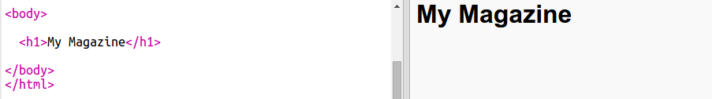

## शीर्षक और पृष्ठभूमि

मैगज़ीन-स्टाइल वाली वेबसाइट्स के पेज पर अक्सर कई छोटी चीज़ें होती हैं। पहले आप अपनी मैगज़ीन के लिए शीर्षक और पृष्ठभूमि बनाएँगे।

+ इस ट्रिंकेट को खोलें: <a href="http://jumpto.cc/web-magazine" target="_blank">jumpto.cc/web-magazine</a>.

	इस प्रोजेक्ट को ऐसा दिखना चाहिए:

	

+ चलिए शीर्षक जोड़ें।

	आप अपनी मैगज़ीन के लिए बेहतर शीर्षक सोच सकते हैं।

	

+ क्या आप शीर्षक को स्टाइल दे सकते हैं?

	उदाहरण इस प्रकार है, परन्तु आप अपना स्वयं का स्टाइल चुन सकते हैं:

	

+ चलिए अब ग्रेडीयंट का इस्तेमाल करके दिलचस्प पृष्ठभूमि बनाएँ और मैगज़ीन के लिए फॉन्ट चुनें।

	ग्रेडीयंट बनाने के तरीके के बारे में रिमाइंडर के तौर पर उदाहरण के रूप में कुछ स्टाइल इस प्रकार हैं:

	

