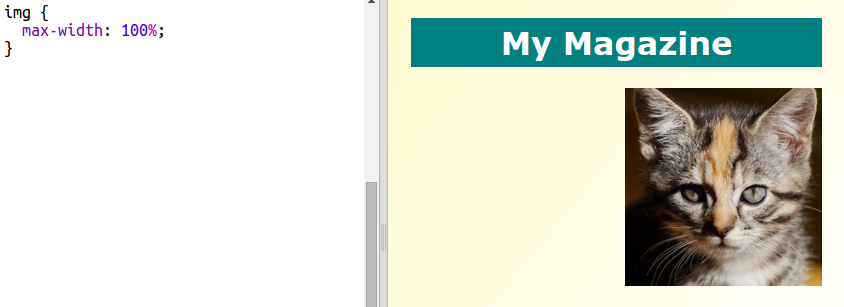

## कॉलम बनाना

वेब्सीटेस अक्सर कई कॉलम का उपयोग करती हैं। चलिए आपकी मैगज़ीन के लिए दो कॉलम लेआउट बनाते है ।

+ पहले दो कॉलमस बनाएं `div`
    
    हाइलाइट किए गए HTML को `index.html` में जोड़ें:
    
    

+ अब कॉलम को स्टाइल करें ताकि एक बायीं ओर और दूसरा दाईं ओर घूमता रहे।
    
    
    
    प्रत्येक कॉलम 50% से कम है इसलिए आपके लिए चीज़ें जोड़ने के लिए जगह है।
    
    प्रभाव देखने के लिए आपको कॉलम में कुछ जोड़ना होगा।

+ चलिए, कॉलम 2 के शुरुआत में एक बिल्ली के बच्चे का चित्र जोड़ें।
    
    
    
    ध्यान दें कि बिल्ली के बच्चे की छवि दूसरे कॉलम में है।
    
    लेकिन यह थोड़ा बड़ा है!

+ चित्रों को उनके कंटेनर में फिट करने के लिए, `max-width:` का प्रयोग करें ।
    
    निम्नलिखित शैली को `style.css` में जोड़ें ।
    
    
    
    यह आपकी मैगज़ीन में आपके द्वारा उपयोग की जाने वाली सभी चित्रों पर लागू होगा, न कि केवल बिल्ली के बच्चे के लिए।

+ अब एक क्लास `photo` अपने चित्र में जोड़े ताकि आप इसे स्टाइल कर सकें:
    
    

+ अपने चित्र की शैली बदलने के लिए, चित्र का साया जोड़े और ऐसा मोड़ दे की लगे की आपका चित्र पृष्ट से बहार आ रहा है ।
    
    
    
    परिणाम पसंद आने तक कुछ बदलाव करते रहे।