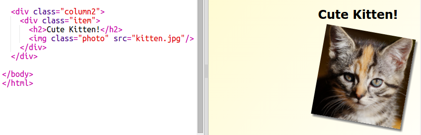

## स्टाइल मैगज़ीन आइटम्स

चलिए लेआउट को कुछ और दिलचस्प बनाएँ।

+ अपने छवि के आसपास `class` के साथ `div` जोड़ें और `h2` शीर्षक जोड़ें:

	

+ अब आइटम और शीर्षक को स्टाइल दें।

	उदाहरण इस प्रकार है, परन्तु आप इसमें परिवर्तन कर सकते हैं:

	

