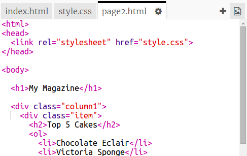

## दूसरा पेज जोड़ें

चलिए आपकी मैगज़ीन की वेबसाइट में अन्य पेज जोड़ें।

+ अपने प्रोकेक्ट में नया पेज जोड़ें और इसका नाम `page2.html` रखें:

+ पेज 2 आपकी मैगज़ीन के प्रथम पेज के काफ़ी समान होगा, इसलिए आप `index.html` से html को कॉपी करके `page2.html` में पेस्ट कर सकते हैं।

ध्यान दें कि दोनों पेज समान `style.css` का उपयोग करते हैं, इसलिए वे स्टाइल साझा करेंगे।

+ पेज 2 के लिए `<h1>` शीर्षक में परिवर्तन करें:

+ अब आपको अपने पेजों के बीच लिंक की आवश्यकता होगी, ताकि आप पेज 2 पर जा सकें और वापस फ्रंट पेज पर आ सकें।

`index.html` पर वापस जाएँ। `index.html` में कॉलम 2 में div के भीतर लिंक जोड़ें:

+ परीक्षण करें कि आप अपने नए लिंक पर क्लिक कर सकते हैं और अपनी मैगज़ीन के पेज 2 पर जा सकते हैं।

