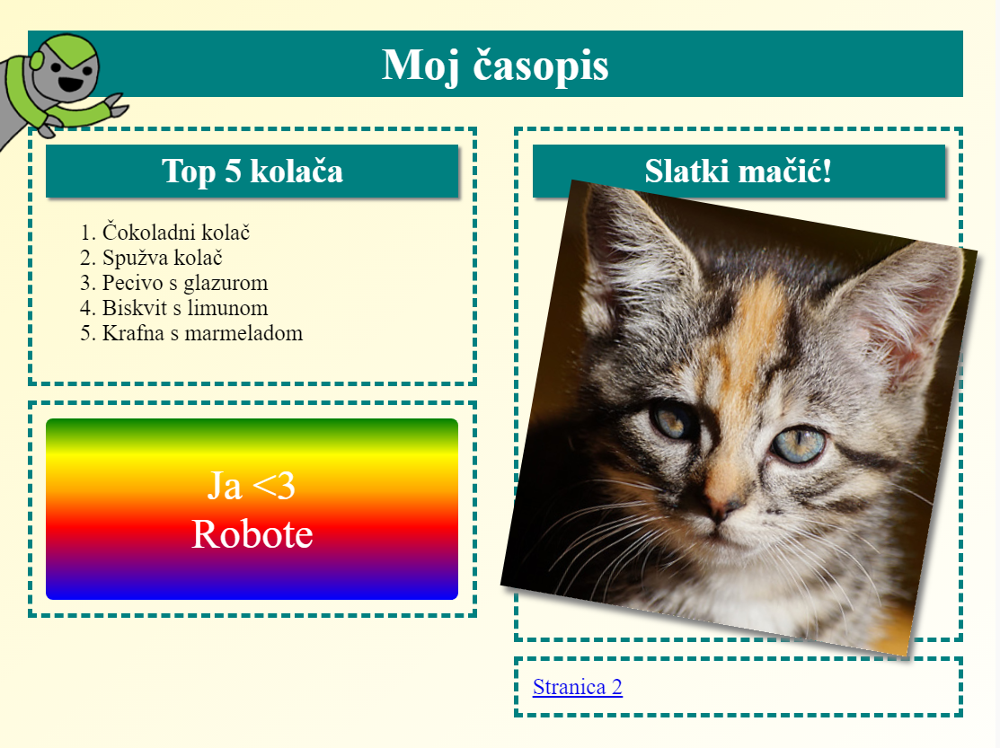

## Uvod

U ovom ćete projektu naučiti kako koristiti HTML i CSS za izradu web sjedišta časopisa s više stranica s dva predloška za stranice. Također ćete pregledati mnogo HTML i CSS tehnika iz drugih projekata.

  <iframe src="https://trinket.io/embed/html/3f63e08a94?outputOnly=true&start=result" width="600" height="505" frameborder="0" marginwidth="0" marginheight="0" allowfullscreen>
  </iframe>
  

### Dodatne informacije za voditelje kluba

Ako želite ispisati ovaj projekt, molimo Vas da koristite [verziju koja je prilagođena za ispis](https://projects.raspberrypi.org/hr-HR/projects/magazine/print).

--- collapse ---
---
title: Bilješke za voditelja kluba
---

## Uvod:

U ovom projektu djeca će naučiti kako stvoriti predložak u dva stupca. Također će napisati puno HTML & CSS-a koje su naučili u drugim projektima.

## Online izvori

Preporučujemo korištenje [trinketa](https://trinket.io/) za pisanje HTML & CSS-a online. Ovaj projekt sadrži sljedeće stvari:

* [Polazna točka "Magazine" - jumpto.cc/web-magazine](http://jumpto.cc/web-magazine)

Djeca također mogu koristiti ovaj prazni trinket [(jumpto.cc/html-blank)](http://jumpto.cc/html-blank) da napišu svoj vlastiti HTML & CSS ili alternativno mogu upotrijebiti ovaj predložak trinket [(jumpto.cc/html-template)](http://jumpto.cc/html-template).

Također je uključen i trinket koji sadrži prijedlog rješenja izazova:

* ['Časopis' Gotovo - trinket.io/html/3f63e08a94](https://trinket.io/html/3f63e08a94)

## Offline izvori

Ako želite, ovaj projekt može biti [završen offline](https://www.codeclubprojects.org/en-GB/resources/webdev-working-offline/). Materijalima projekta možete pristupiti klikom na poveznicu 'Project Materials'. Poveznica sadrži odjeljak 'Project Resources' u kojemu se nalaze materijali koji će djeci biti potrebni za izradu projekta offline. Pobrinite se da svako dijete ima pristup kopiji ovih materijala. U odjeljku se nalaze sljedeće datoteke:

* Uvod / index.html
* template/template.html
* template/style.css
* Magazin / index.html
* Magazin / style.css
* časopis / script.js
* časopis / mutliple .png slike

Dovršenu verziju projektnih izazova možete pronaći i u odjeljku 'Volunteer Resources' koji sadrži:

* magazin-gotovih / index.html
* magazin-gotovih / style.css
* magazin-gotovih / script.js
* magazin-gotovih / macic.jpg
* magazin-gotovih / recept-finished.jpg
* magazin-gotovih / greenrobot.png
* magazin-gotovih / spacerobot.png

(Svi spomenuti materijali nalaze se u materijalima projekta i materijalima za volontere, koje je moguće preuzeti kao `.zip` datoteke.)

## Ishodi učenja

* Ovaj projekt podučava djecu kako stvoriti stil za predložak časopisa u dva stupca pomoću atributa `float:`. Također ponavlja i mnogo HTML & CSS-a koji je detaljnije objašnjen u drugim projektima. Primjeri su dani kako bi djeca mogla dovršiti ovaj projekt čak i ako nisu dovršili neke od ranijih projekata. 

Ovaj projekt obuhvaća elemente iz sljedećih dijelova [Raspberry Pi Digital Making](https://rpf.io/curriculum) nastavnog plana i programa:

* [Dizajnirajte osnovna 2D i 3D sredstva](https://www.raspberrypi.org/curriculum/design/creator).

## Izazovi

* "Dodavanje stavki u lijevi stupac" - stavljanje stavki unutar plutajućeg elementa;
* "Dodaj vezu natrag na prvu stranicu" - stvaranje veza između stranica u projektu;
* "Ispunite drugu stranicu" - ponavljanje dodatnog HTML & CSS-a;
* "Dodajte još jednu animaciju" - ponavljanje animacije.

--- /collapse ---

--- collapse ---
---
title: Materijali projekta
---

## Resursi projekta

* [.zip datoteka koja sadrži sve materijale projekta](resources/magazine-project-resources.zip)
* [Online Trinket koji sadrži sve resurse projekta 'Magazine'](http://jumpto.cc/web-magazine)
* [Online Trinket predložak](http://jumpto.cc/trinket-template)
* [Online prazan Trinket](http://jumpto.cc/trinket-blank)
* [template/index.html](resources/template-index.html)
* [template/style.css](resources/template-style.css)
* [Uvod / index.html](resources/intro-index.html)
* [Uvod / style.css](resources/intro-style.css)
* [Magazin / index.html](resources/magazine-index.html)
* [Magazin / style.css](resources/magazine-style.css)
* [časopis / script.js](resources/magazine-script.js)
* [Magazin / macic.jpg](resources/magazine-kitten.jpg)
* [Magazin / recept-final.png](resources/magazine-recipe-final.png)
* [Magazin / greenrobot.png](resources/magazine-greenrobot.png)
* [Magazin / firerobot.png](resources/magazine-firerobot.png)
* [Magazin / spacerobot.png](resources/magazine-spacerobot.png)
* [Magazin / dogrobot.png](resources/magazine-dogrobot.png)

## Resursi voditelja kluba

* [.zip datoteka koja sadrži sve dovršene resurse projekta](resources/magazine-volunteer-resources.zip)
* [Dovršeni Online Trinket projekt](https://trinket.io/html/3f63e08a94)
* [magazin-gotovih / index.html](resources/magazine-finished-index.html)
* [magazin-gotovih / style.css](resources/magazine-finished-style.css)
* [magazin-gotovih / script.js](resources/magazine-finished-script.js)
* [magazin-gotovih / macic.jpg](resources/magazine-finished-kitten.jpg)
* [magazin-gotovih / recept-final.png](resources/magazine-finished-recipe-final.png)
* [magazin-gotovih / greenrobot.png](resources/magazine-finished-greenrobot.png)
* [magazin-gotovih / spacerobot.png](resources/magazine-finished-spacerobot.png)

--- /collapse ---