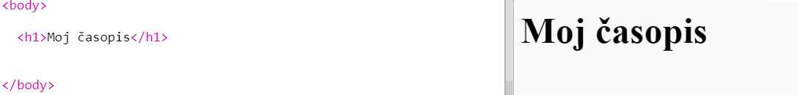
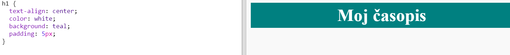
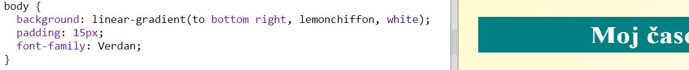

## Naslov i pozadina

Web-lokacije časopisa često imaju puno sitnih stavki na stranici. Najprije ćete stvoriti naslov i pozadinu svog časopisa.

+ Otvori ovaj trinket: <a href="http://jumpto.cc/web-magazine" target="_blank">jumpto.cc/web-magazine</a>.
    
    Projekt bi trebao izgledati ovako:
    
    

+ Dodajte naslov.
    
    Možete misliti na bolji naslov svog časopisa.
    
    

+ Možete li stilirati naslov?
    
    Evo primjera, ali možete odabrati svoj stil:
    
    

+ Sada stvorimo zanimljivu pozadinu koristeći gradijent i odaberite font za časopis.
    
    Evo nekog primjera stila kao podsjetnika o tome kako izraditi gradijent:
    
    