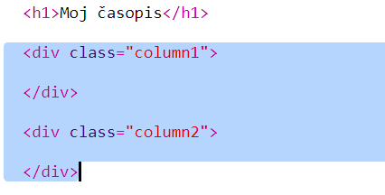

## Stvaranje stupaca

Web-lokacije često upotrebljavaju više stupaca. Izradimo izgled za dva stupca za svoj časopis.

+ Prvo izradite dva stupca `div`s.
    
    Dodajte označeni HTML u `index.html`:
    
    

+ Sada oblikujte divove stupca tako da jedan lebdi lijevo, a drugi pluta desno.
    
    
    
    Svaki stupac je manji od 50% pa postoji mjesta za padanje.
    
    Morat ćete dodati nešto u stupac da biste vidjeli učinak.

+ Dodaj sliku mačića na vrh stupca 2.
    
    
    
    Primijetite da je slika mačića postavljena oko pola puta preko stranice, u drugom stupcu.
    
    Ipak, malo je velika!

+ Koristimo `maks. Širinu:` da bi slike bile prikladne u njihovom spremniku.
    
    Dodajte sljedeći stil na `style.css`.
    
    
    
    To će se odnositi na sve slike koje koristite u svom časopisu, a ne samo na mačića.

+ Sada dodaj sliku `` na sliku da biste ga mogli oblikovati:
    
    

+ I stilizirati sliku da biste dodali sjenu i pomaknuti kako bi fotografija nestala sa stranice:
    
    
    
    Izvršite izmjene dok ne poželite rezultat.