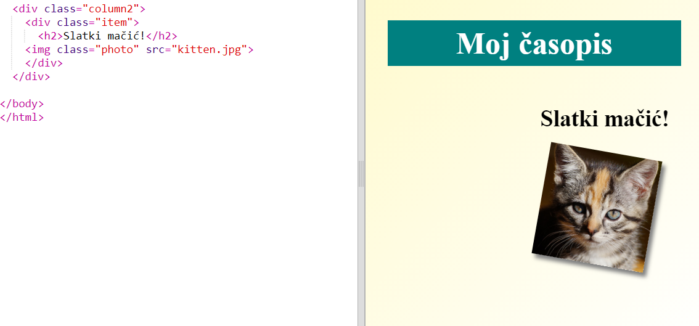
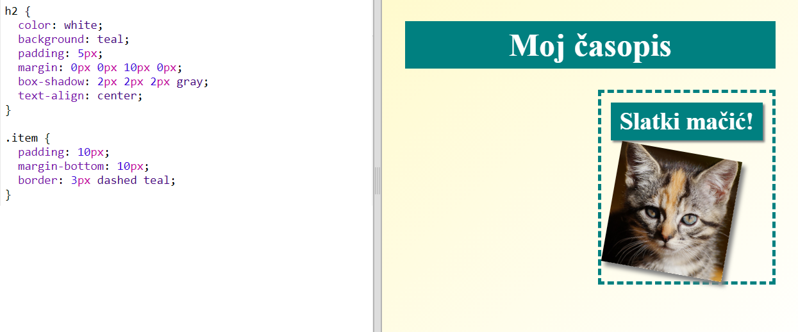

## Stavke časopisa stila

Neka napravimo izgled malo zanimljivijim.

+ Dodajte `div` oko slike na `klasi` i dodajte naslov `h2`:
    
    

+ Sada stil stavku i naslov.
    
    Evo primjera, ali možete unijeti izmjene:
    
    