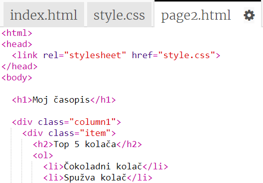
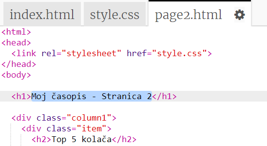
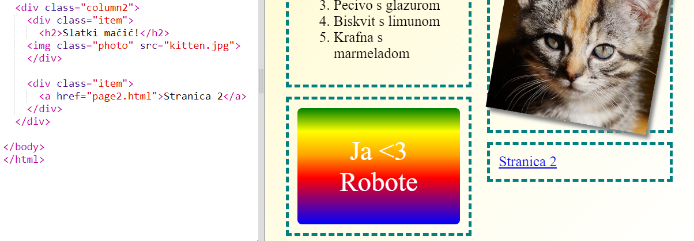

## Dodajte drugu stranicu

Dodajte još jednu stranicu na web mjesto časopisa.

+ Dodajte novu stranicu u svoj projekt i nazovite ga `page2.html`:

+ Stranica 2 bit će prilično slična prvoj stranici časopisa, tako da možete kopirati html iz `index.html` i zalijepiti ga u `page2.html`.

Imajte na umu da obje stranice koriste isti `style.css` tako da će dijeliti stilove.

+ Promijenite `<h1>` naslov za stranicu2:

+ Now you'll need links between your pages so you can get to page 2 and back to the front page.

Vratite se na `index.html`. Dodajte vezu unutar diva u stupcu 2 u `index.html`:

+ Ispitajte da možete kliknuti na svoju novu vezu i prijeći na stranicu 2 svog časopisa.