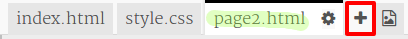

## Dodajte drugu stranicu

Dodajte još jednu stranicu na web sjedište časopisa.

+ Dodajte novu stranicu u svoj projekt i nazovite ju `page2.html`:

+ Stranica 2 bit će prilično slična prvoj stranici časopisa, tako da možete kopirati html iz `index.html` i zalijepiti ga u `page2.html`.

Imajte na umu da obje stranice koriste isti `style.css` tako da će dijeliti stilove.

+ Promijenite `<h1>` naslov za stranicu2:

+ Sada ćete trebati poveznice između vaših stranica kako bi mogli doći do stranice 2 i natrag na početnu stranicu.

Vratite se na `index.html`. Dodajte vezu unutar diva u stupcu 2 u `index.html`:

+ Provjerite možete li na svoju novu vezu i prijeći na stranicu 2 svog časopisa.