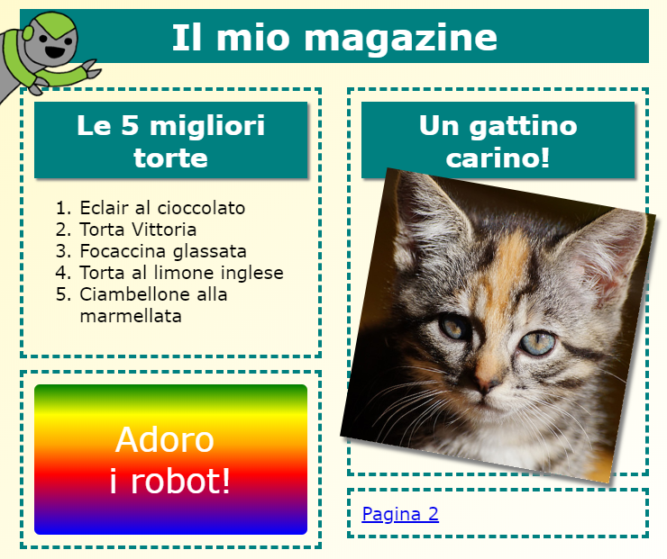

## Introduzione

In questo progetto imparerai come usare HTML e CSS per creare un sito Web in stile rivista con due pagine. Inoltre, ripasserai tante tecniche di HTML e CSS che hai già incontrato in altri progetti.

  <iframe src="https://trinket.io/embed/html/a41e4e1c5c?outputOnly=true&start=result" width="600" height="505" frameborder="0" marginwidth="0" marginheight="0" allowfullscreen>
  </iframe>
  

### Ulteriori informazioni per gli organizzatori di club

Se intendete stampare questo progetto, cliccate su [Versione stampabile](https://projects.raspberrypi.org/en/projects/magazine/print).

## \--- collapse \---

## title: Note per gli organizzatori di club

## Introduction

In questo progetto, i ragazzi impareranno come creare una struttura a due colonne per una pagina web. Inoltre, ritroveranno molte tecniche di HTML e CSS che hanno già imparato in altri progetti.

## Risorse online

Consigliamo di usare un [trinket](https://trinket.io/) per scrivere in HTML e CSS online. Questo progetto contiene i seguenti trinket:

* ['Magazine' punto di partenza -- jumpto.cc/web-magazine](http://jumpto.cc/web-magazine)

I ragazzi possono anche usare questo trinket vuoto [(jumpto.cc/html-blank)](http://jumpto.cc/html-blank) per scrivere liberamente in HTML e CSS, oppure possono usare questo modello di trinket [(jumpto.cc/html-template)](http://jumpto.cc/html-template).

È disponibile anche un trinket con un esempio di soluzione alle challenges:

* ['Magazine' finito -- trinket.io/html/a41e4e1c5c](https://trinket.io/html/a41e4e1c5c)

## Risorse offline

Questo progetto può essere [completato offline](https://www.codeclubprojects.org/en-GB/resources/webdev-working-offline/) se preferite. È possibile accedere alle risorse del progetto facendo click sul link "Materiali del progetto" relativo a questo progetto. Questo link contiene una sezione "Risorse del progetto", che include le risorse necessarie ai ragazzi per completare il progetto offline. Assicuratevi che ogni ragazzo abbia accesso a una copia di queste risorse. Questa sezione include i seguenti file:

* intro/index.html
* template/template.html
* template/style.css
* magazine/index.html
* magazine/style.css
* magazine/script.js
* magazine/mutliple .png images

Una versione completa delle sfide di questo progetto è presente anche nella sezione “Risorse per i volontari”, che contiene:

* magazine-finished/index.html
* magazine-finished/style.css
* magazine-finished/script.js
* magazine-finished/kitten.jpg
* magazine-finished/recipe-finished.jpg
* magazine-finished/greenrobot.png
* magazine-finished/spacerobot.png

(Tutte le risorse indicate possono essere scaricate anche come file `.zip` di progetto, anche per i volontari.)

## Obiettivi di apprendimento

* Questo progetto insegna ai ragazzi come creare una struttura di una rivista a due colonne usando l'attributo `float:`. Inoltre, include molte tecniche di HTML e CSS che sono state approfondite in altri progetti. Sono presenti degli esempi, per permettere ai ragazzi di completare questo progetto anche se non hanno completato alcuni di quelli precedenti. 

Questo progetto include elementi tratti dalle seguenti sezioni del [Digital Making Curriculum di Raspberry Pi](http://rpf.io/curriculum):

* [Design di base in 2D e risorse 3D](https://www.raspberrypi.org/curriculum/design/creator).

## Sfide

* "Aggiungi elementi alla colonna di sinistra" - inserire elementi in una colonna impostata con l'attributo "float";
* "Aggiungi un link per tornare alla prima pagina " - creare un link tra due pagine in un progetto;
* "Compila la seconda pagina" - ripassare molte tecniche di HTML e CSS;
* "Aggiungi un’altra animazione" - ripassare le animazioni.

\--- /collapse \---

## \--- collapse \---

## title: Materiali del progetto

## Risorse del progetto

* [File .zip con tutte le risorse del progetto](resources/magazine-project-resources.zip)
* [Trinket online contenente tutte le risorse del progetto 'Magazine'](http://jumpto.cc/web-magazine)
* [Modello di Trinket online](http://jumpto.cc/trinket-template)
* [Trinket online vuoto](http://jumpto.cc/trinket-blank)
* [template/index.html](resources/template-index.html)
* [template/style.css](resources/template-style.css)
* [intro/index.html](resources/intro-index.html)
* [intro/style.css](resources/intro-style.css)
* [magazine/index.html](resources/magazine-index.html)
* [magazine/style.css](resources/magazine-style.css)
* [magazine/script.js](resources/magazine-script.js)
* [magazine/kitten.jpg](resources/magazine-kitten.jpg)
* [magazine/recipe-final.png](resources/magazine-recipe-final.png)
* [magazine/greenrobot.png](resources/magazine-greenrobot.png)
* [magazine/firerobot.png](resources/magazine-firerobot.png)
* [magazine/spacerobot.png](resources/magazine-spacerobot.png)
* [magazine/dogrobot.png](resources/magazine-dogrobot.png)

## Risorse per gli organizzatori di club

* [File .zip con tutte le risorse del progetto completate](resources/magazine-volunteer-resources.zip)
* [Trinket online completato](https://trinket.io/html/a41e4e1c5c)
* [magazine-finished/index.html](resources/magazine-finished-index.html)
* [magazine-finished/style.css](resources/magazine-finished-style.css)
* [magazine-finished/script.js](resources/magazine-finished-script.js)
* [magazine-finished/kitten.jpg](resources/magazine-finished-kitten.jpg)
* [magazine-finished/recipe-final.png](resources/magazine-finished-recipe-final.png)
* [magazine-finished/greenrobot.png](resources/magazine-finished-greenrobot.png)
* [magazine-finished/spacerobot.png](resources/magazine-finished-spacerobot.png)

\--- /collapse \---