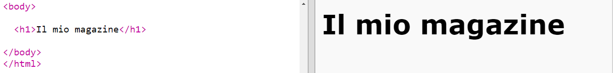
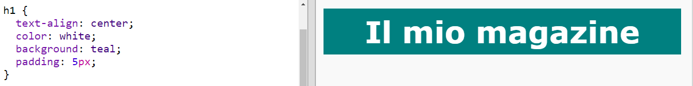
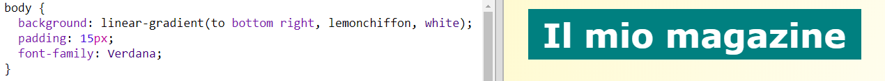

## Intestazione e sfondo

Spesso, i siti web in stile rivista hanno molti elementi piccoli in ogni pagina. Per prima cosa, creeremo un'intestazione e uno sfondo per la tua rivista.

+ Apri questo trinket: <a href="http://jumpto.cc/web-magazine" target="_blank">jumpto.cc/web-magazine</a>.
    
    Il progetto dovrebbe assomigliare a questo:
    
    

+ Aggiungiamo un'intestazione.
    
    Puoi pensare ad un nome migliore per la tua rivista.
    
    

+ Puoi applicare uno stile alla tua intestazione?
    
    Questo è un esempio, ma puoi scegliere il tuo stile personale:
    
    

+ Ora creiamo uno sfondo interessante, usando un gradiente, e scegliamo un font per la rivista.
    
    Ecco qualche esempio per ricordare come creare un gradiente:
    
    