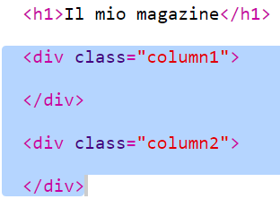
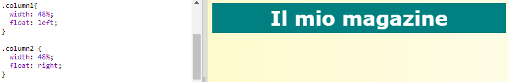
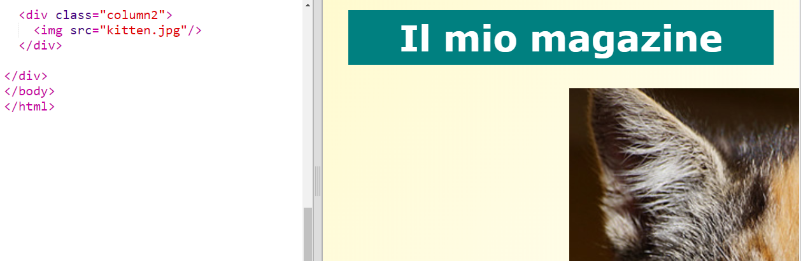
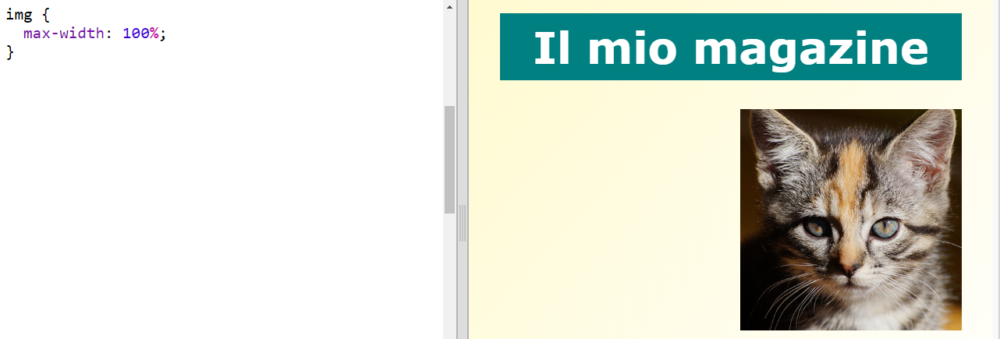

## Creazione di colonne

I siti Web utilizzano spesso molteplici colonne. Creiamo un layout a due colonne per la rivista.

+ Per prima cosa, crea due colonne con il tag `div`.

	Aggiungi l’HTML evidenziato a `index.html`:

	

+ Ora attribuisci uno stile alle divisioni in colonne in modo che una si sposti verso sinistra e l’altra verso destra.

	

	Ciascuna colonna è inferiore al 50%; c’è quindi spazio per un riempimento.

	Per vedere il risultato, dovrai aggiungere qualcosa a una colonna.

+ Aggiungiamo la foto di un gatto nella parte superiore della colonna 2.

	

	L’immagine del gatto è posizionata su circa metà della pagina nella seconda colonna.

	Però è un po’ grande!

+ Utilizziamo`max-width: ` per ridimensionare le immagini in modo che si adattino al loro contenitore.

	Aggiungi lo stile seguente a `style.css`.

	

	Verrà applicato a tutte le immagini utilizzate nella rivista, non solo a quella del gatto.

+ Ora aggiungi la classe `photo` all’immagine in modo da attribuirle uno stile:

	

+ E attribuisci uno stile all’immagine in modo da aggiungere un’ombra e una rotazione per far emergere la foto dalla pagina:

	

	Effettua delle modifiche finché non sarai soddisfatto/a del risultato.

