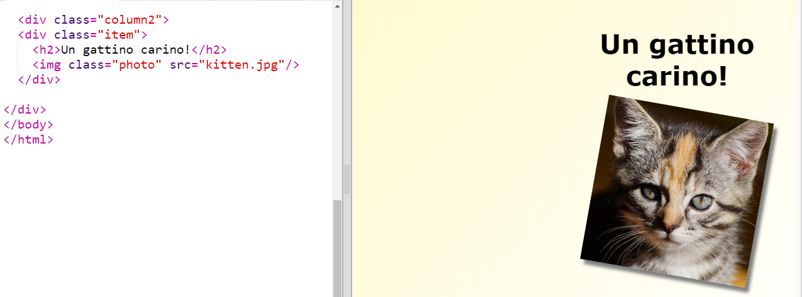
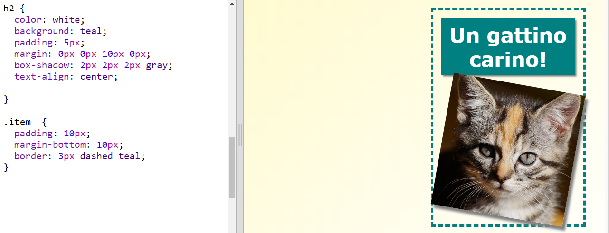

## Attribuisci uno stile agli elementi della rivista

Abbelliamo un po' la struttura della pagina.

+ Aggiungi un `div` attorno alla tua immagine con una `class` e un'intestazione di tipo `h2`:
    
    

+ Ora modifica lo stile del contenitore e dell'intestazione.
    
    Questo è un esempio, ma puoi modificarla come vuoi:
    
    