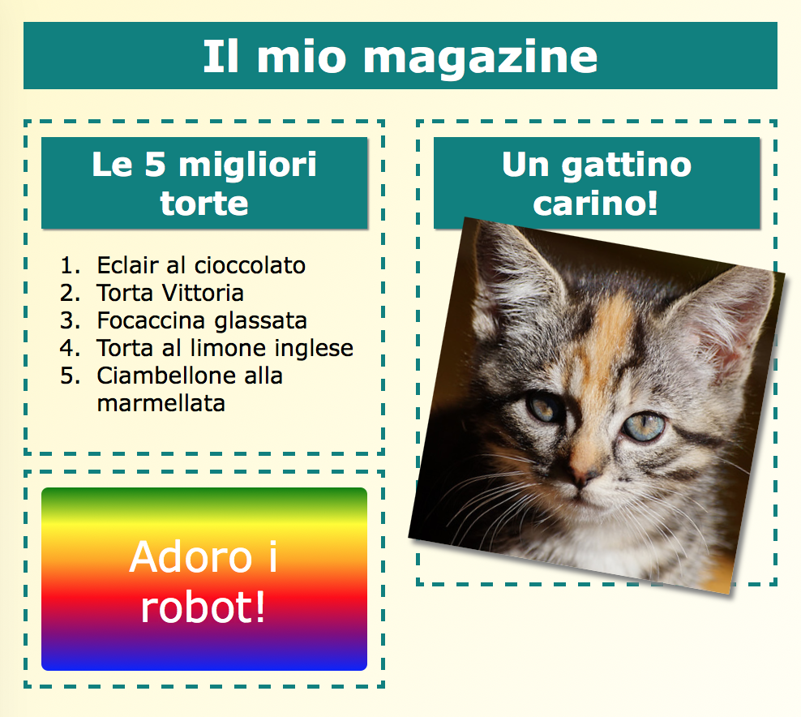
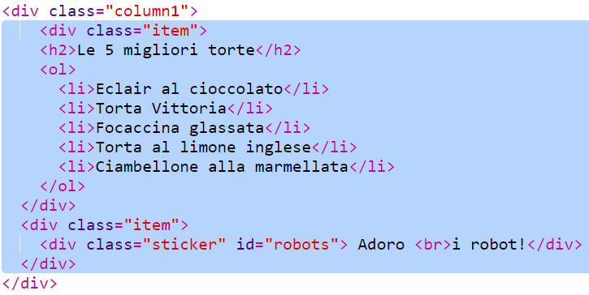

--- challenge ---

## Sfida: aggiungi elementi alla colonna di sinistra

Sei in grado di aggiungere una lista ordinata e un testo colorato tramite gradiente alla colonna di sinistra?

Ecco un esempio:

Questo è il codice dell'esempio, ma puoi cambiarlo o scrivere il tuo codice personale.

HTML:

CSS:

--- /challenge ---