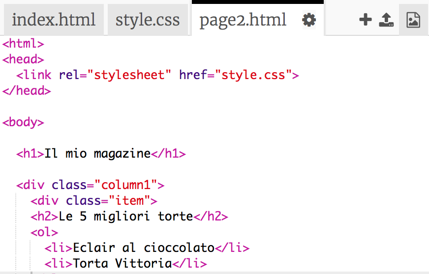
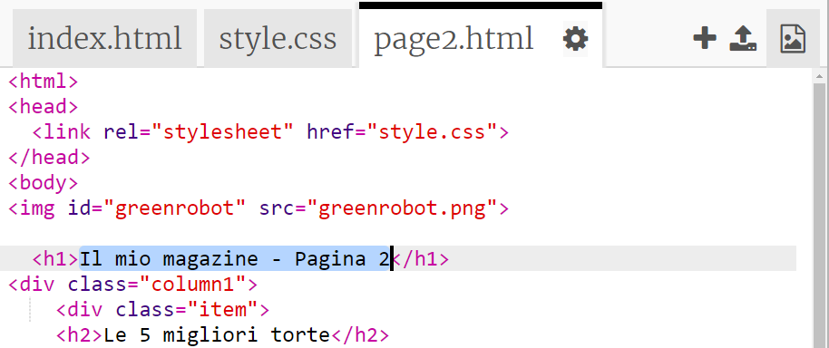
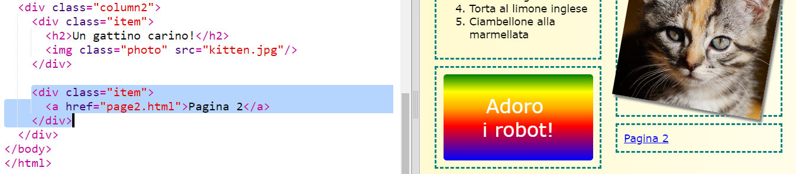

## Aggiungi una seconda pagina

Aggiungiamo un'altra pagina al nostro sito Web in stile rivista.

+ Aggiungi una nuova pagina al tuo progetto e chiamala `page2.html`:

+ La seconda pagina sarà abbastanza simile alla prima pagina della tua rivista, quindi puoi copiare il codice HTML da `index.html` e incollarlo in `page2.html`.

Nota che entrambe le pagine usano `style.css`, quindi condivideranno lo stile.

+ Cambia l'intestazione `<h1>` title: nella seconda pagina:

+ Now you'll need links between your pages so you can get to page 2 and back to the front page.

Torna a `index.html`. Aggiungi un link in un div nella seconda colonna in `index.html`:

+ Assicurati di poter cliccare sul tuo nuovo link e andare alla seconda pagina della tua rivista.