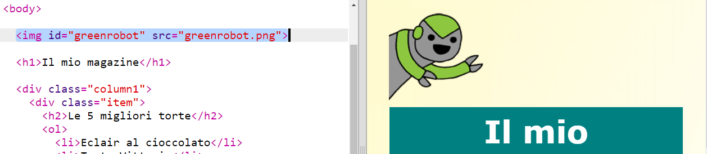
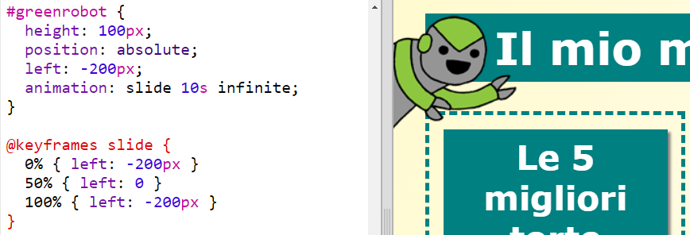

##  Aggiungi un’animazione

Aggiungiamo un’animazione divertente alla rivista.

+ Vai a `index.html` e includi l’immagine `greenrobot.png` nella parte superiore della pagina.

+ Aggiungi ora il CSS per animare il robot:

