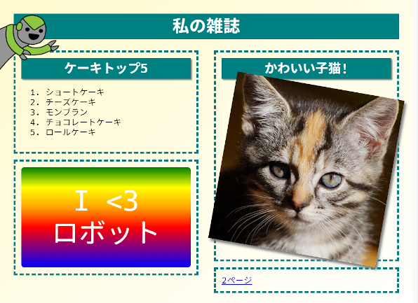

## はじめに

このプロジェクトでは、2ページ構成になっている雑誌のウェブサイトを作成するために、HTMLとCSSを利用する方法を学びます。他のプロジェクトが提供しているHTMLやCSSのテクニックもおさらいしましょう。

  <iframe src="https://trinket.io/embed/html/a41e4e1c5c?outputOnly=true&start=result" width="600" height="505" frameborder="0" marginwidth="0" marginheight="0" allowfullscreen>
  </iframe>
  

### クラブ・リーダーのための追加情報

このプロジェクトを印刷する必要がある場合は、 [印刷用バージョン](https://projects.raspberrypi.org/en/projects/magazine/print)を使用してください。

## \--- collapse \---

## title：クラブ・リーダー用の覚書

## はじめに

このプロジェクトでは、子どもたちは2段組のレイアウトを作成する方法を学びます。他のプロジェクトで学んだ多くのHTMLとCSSについてもまとめます。

## オンライン上にある情報源

オンラインでHTMLやCSSを書くために[trinket](https://trinket.io/)を使うことをおすすめします。このプロジェクトには以下のtrinketが含まれています。

* [「雑誌」出発地点 - jumpto.cc/web-magazine](http://jumpto.cc/web-magazine)

子どもたちは何も書かれていないtrinket [(jumpto.cc/html-blank)](http://jumpto.cc/html-blank) を使って、自分たちのHTMLやCSSを書くこともできますし、テンプレートtrinket [(jumpto.cc/html-template)](http://jumpto.cc/html-template)を使用することもできます。

また、チャレンジの回答例を含むtrinketもあります。

* [「雑誌」完成 -- trinket.io/html/a41e4e1c5c](https://trinket.io/html/a41e4e1c5c)

## オフラインの情報源

このプロジェクトは必要であれば[オフラインで完了](https://www.codeclubprojects.org/en-GB/resources/webdev-working-offline/)できます。 必要なプロジェクト資料を入手するには、「プロジェクト資料」のリンクをクリックしてください。 このリンクには「プロジェクト資料」の部分があり、子どもたちがこのプロジェクトをオフラインで完了するのに必要な資料が含まれています。 子どもたちがこれらの資料のコピーにアクセスできるか確認してください。 この部分には以下のファイルが含まれます：

* intro/index.html
* template/template.html
* template/style.css
* magazine/index.html
* magazine/style.css
* magazine/script.js
* magazine/mutliple .png images

なお、このプロジェクトにあるチャレンジの完成版は「ボランティア資料」の部分にもあり、以下を含んでいます：

* magazine-finished/index.html
* magazine-finished/style.css
* magazine-finished/script.js
* magazine-finished/kitten.jpg
* magazine-finished/recipe-finished.jpg
* magazine-finished/greenrobot.png
* magazine-finished/spacerobot.png

(All of the resources above are also downloadable as project and volunteer `.zip` files.)

## Learning Objectives

* This project teaches children how to create a two-column magazine style layout using `float:`. It also recaps lots of the HTML & CSS that is covered in more detail in other projects. Examples are given so children will be able to complete this project even if they have not completed some of the earlier projects. 

This project covers elements from the following strands of the [Raspberry Pi Digital Making Curriculum](http://rpf.io/curriculum):

* [Design basic 2D and 3D assets](https://www.raspberrypi.org/curriculum/design/creator).

## Challenges

* "Add items to the left column" - placing items inside a floated element;
* "Add a link back to the first page" - creating links between pages in a project;
* "Fill in your second page" - recapping more HTML & CSS;
* "Add another animation" - recapping animations.

\--- /collapse \---

## \--- collapse \---

## title: Project materials

## Project resources

* [.zip file containing all project resources](https://rpf.io/p/en/magazine-go)
* [Online Trinket containing all 'Magazine' project resources](http://jumpto.cc/web-magazine)
* [Online Trinket template](http://jumpto.cc/trinket-template)
* [Online blank Trinket](http://jumpto.cc/trinket-blank)
* [template/index.html](resources/template-index.html)
* [template/style.css](resources/template-style.css)
* [intro/index.html](resources/intro-index.html)
* [intro/style.css](resources/intro-style.css)
* [magazine/index.html](resources/magazine-index.html)
* [magazine/style.css](resources/magazine-style.css)
* [magazine/script.js](resources/magazine-script.js)
* [magazine/kitten.jpg](resources/magazine-kitten.jpg)
* [magazine/recipe-final.png](resources/magazine-recipe-final.png)
* [magazine/greenrobot.png](resources/magazine-greenrobot.png)
* [magazine/firerobot.png](resources/magazine-firerobot.png)
* [magazine/spacerobot.png](resources/magazine-spacerobot.png)
* [magazine/dogrobot.png](resources/magazine-dogrobot.png)

## Club leader resources

* [.zip file containing all completed project resources](https://rpf.io/p/en/magazine-go)
* [Online completed Trinket project](https://trinket.io/html/a41e4e1c5c)
* [magazine-finished/index.html](resources/magazine-finished-index.html)
* [magazine-finished/style.css](resources/magazine-finished-style.css)
* [magazine-finished/script.js](resources/magazine-finished-script.js)
* [magazine-finished/kitten.jpg](resources/magazine-finished-kitten.jpg)
* [magazine-finished/recipe-final.png](resources/magazine-finished-recipe-final.png)
* [magazine-finished/greenrobot.png](resources/magazine-finished-greenrobot.png)
* [magazine-finished/spacerobot.png](resources/magazine-finished-spacerobot.png)

\--- /collapse \---