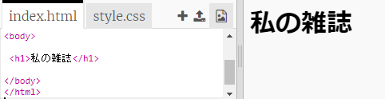
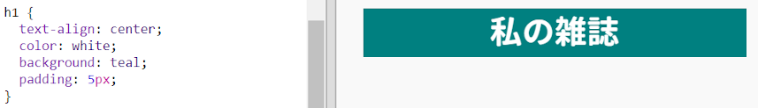
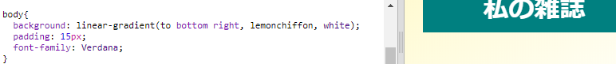

## 見出しと背景

雑誌スタイルのウェブサイトでは、多くの場合、ページに小さなアイテムがたくさんあります。まず、雑誌の見出しと背景を作成します。

+ Trinketをひらく: <a href="http://jumpto.cc/web-magazine" target="_blank">jumpto.cc/web-magazine</a>.
    
    プロジェクトはこのようになります。
    
    

+ 見出しを追加しましょう。
    
    あなたはあなたの雑誌のより良いタイトルを考えることができます。
    
    

+ 見出しを書式設定できますか？
    
    ここに例がありますが、独自のスタイルを選択できます：
    
    

+ グラデーションを使用して面白い背景を作成し、雑誌のフォントを選択しましょう。
    
    グラデーションの作成方法を覚えておくためのスタイルの例をいくつか示します：
    
    