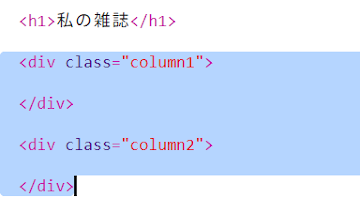
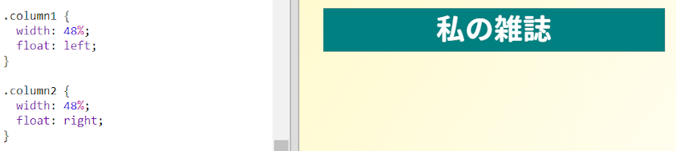
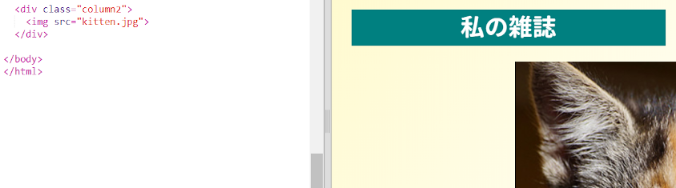
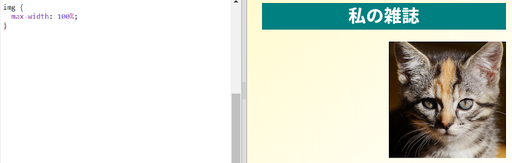

## 列の作成

ウェブサイトでは複数の列が使用されることがよくありますマガジンの2列のレイアウトを作成しましょう。

+ 最初に2つの列 `div`作成します。
    
    強調表示されたHTMLを `追加するindex.html`：
    
    

+ 1つは左に浮動し、もう1つは右に浮動するように列divをスタイルします。
    
    
    
    各列は50％未満ですので、パディングの余地があります。
    
    その効果を見るには、何かを列に追加する必要があります。

+ 列2の上部に子猫の画像を追加しましょう。
    
    
    
    子猫の画像は、第2列のページのほぼ中間に配置されていることに注意してください。
    
    それは少し大きいです！

+ `max-width：` を使って画像をコンテナ内に収めてみましょう。
    
    次のスタイルを `style.cssに追加します`。
    
    
    
    これは、子猫だけでなく、雑誌で使用しているすべての画像に適用されます。

+ 今度はクラス `写真` を画像に追加して、スタイルをつけることができます：
    
    

+ また、画像のスタイルを変更して、写真をページから外に出すように影とひねりを加えます。
    
    
    
    結果が好きになるまで少し変更してください。