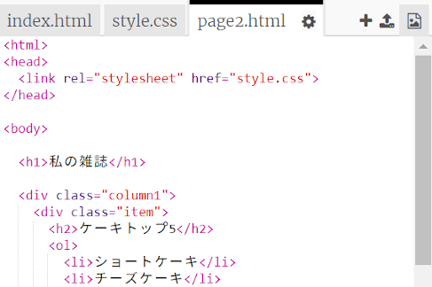
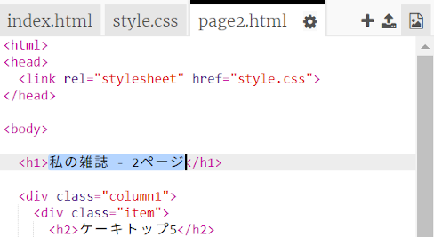
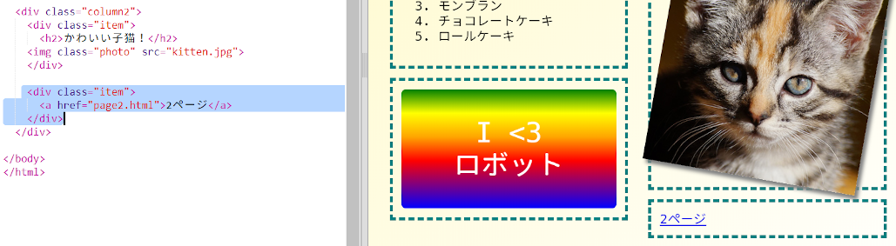

## 2ページ目の追加

雑誌のウェブサイトに別のページを追加しましょう。

+ プロジェクトに新しいページを追加して、名前を `page2.html`にします：

+ ページ2はあなたの雑誌の最初のページとよく似ているので、`index.html`からHTMLをコピーして`page2.html`に貼り付けることができます。

両方のページで同じ`style.css`を使用するので、スタイルを共有することに注意してください。

+ ページ2の`<h1>`見出しを変更

+ ページ2にたどり着き、フロントページに戻ることができるようにページ間にリンクが必要です。

`index.html`に戻りましょう。 `index.html`にある列2のdiv内にリンクを追加します：

+ 新しいリンクをクリックして、雑誌の2ページに移動できることをテストします。