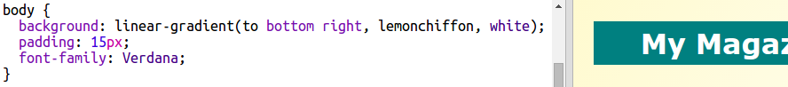

## ಶೀರ್ಷಿಕೆ ಮತ್ತು ಹಿನ್ನೆಲೆ

ಮ್ಯಾಗಜೀನ್ ಶೈಲಿಯ ವೆಬ್‌ಸೈಟ್‌ಗಳು ಸಾಮಾನ್ಯವಾಗಿ ಪುಟದಲ್ಲಿ ಸಾಕಷ್ಟು ಸಣ್ಣ ವಸ್ತುಗಳನ್ನು ಹೊಂದಿರುತ್ತವೆ. ಮೊದಲು ನೀವು ನಿಮ್ಮ ನಿಯತಕಾಲಿಕೆಗೆ ಶೀರ್ಷಿಕೆ ಮತ್ತು ಹಿನ್ನೆಲೆ ರಚಿಸಲು ಹೊರಟಿದ್ದೀರಿ.

+ ಈ trinket ಅನ್ನು ತೆರೆಯಿರಿ:<a href="http://jumpto.cc/web-magazine" target="_blank">jumpto.cc/web-magazine</a>.
    
    ಯೋಜನೆಯು ಈ ರೀತಿ ಕಾಣಿಸಬೇಕು:
    
    

+ ಶೀರ್ಷಿಕೆಯನ್ನು ಸೇರಿಸೋಣ.
    
    ನಿಮ್ಮ ಪತ್ರಿಕೆಗೆ ಉತ್ತಮ ಶೀರ್ಷಿಕೆಯ ಬಗ್ಗೆ ನೀವು ಯೋಚಿಸಬಹುದು.
    
    

+ ನೀವು ಶೀರ್ಷಿಕೆಯನ್ನು ವಿನ್ಯಾಸಗೊಳಿಸಬಹುದೇ?
    
    ಇಲ್ಲಿ ಒಂದು ಉದಾಹರಣೆ ಇಲ್ಲಿದೆ, ಆದರೆ ನೀವು ನಿಮ್ಮ ಸ್ವಂತ ಶೈಲಿಯನ್ನು ಆಯ್ಕೆ ಮಾಡಬಹುದು:
    
    

+ ಈಗ ಗ್ರೇಡಿಯಂಟ್ ಬಳಸಿ ಆಸಕ್ತಿದಾಯಕ ಹಿನ್ನೆಲೆಯನ್ನು ರಚಿಸೋಣ ಮತ್ತು ಪತ್ರಿಕೆಯ ಫಾಂಟ್ ಆಯ್ಕೆ ಮಾಡೋಣ.
    
    ಗ್ರೇಡಿಯಂಟ್ ಅನ್ನು ಹೇಗೆ ರಚಿಸುವುದು ಎಂಬುದರ ಜ್ಞಾಪನೆಯಾಗಿ ಕೆಲವು ಉದಾಹರಣೆ ಶೈಲಿ ಇಲ್ಲಿದೆ:
    
    