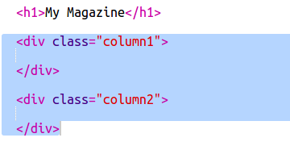
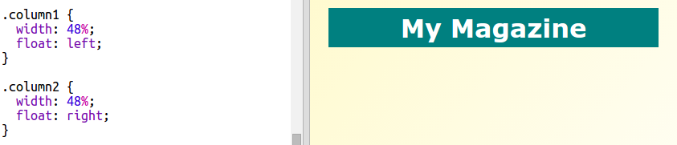

## ಸಾಲುಗಳನ್ನು ರಚಿಸಲಾಗುತ್ತಿದೆ

ವೆಬ್‌ಸೈಟ್‌ಗಳು ಹೆಚ್ಚಾಗಿ ಅನೇಕ ಸಾಲುಗಳನ್ನು ಬಳಸುತ್ತವೆ. ನಿಮ್ಮ ಪತ್ರಿಕೆಗೆ ಎರಡು ಕಾಲಮ್ ವಿನ್ಯಾಸವನ್ನು ರಚಿಸೋಣ.

+ ಮೊದಲು ಎರಡು ಸಾಲನ್ನು ರಚಿಸಿ `div` ರು.
    
    ಚಿತ್ರವನ್ನು `index.html` ಗೆ ಸೇರಿಸಿ:
    
    

+ ಈಗ ಸಾಲಿನ ಡಿವ್‌ಗಳನ್ನು ಸ್ಟೈಲ್ ಮಾಡಿ ಇದರಿಂದ ಒಂದು ಎಡಕ್ಕೆ ತೇಲುತ್ತದೆ ಮತ್ತು ಇನ್ನೊಂದು ಬಲಕ್ಕೆ ತೇಲುತ್ತದೆ.
    
    
    
    ಪ್ರತಿಯೊಂದು ಸಾಲು 50% ಕ್ಕಿಂತ ಕಡಿಮೆಯಿರುತ್ತದೆ ಆದ್ದರಿಂದ ಪ್ಯಾಡಿಂಗ್‌ಗೆ ಅವಕಾಶವಿದೆ.
    
    ಪರಿಣಾಮವನ್ನು ನೋಡಲು ನೀವು ಸಾಲಿಗೆ ಏನನ್ನಾದರೂ ಸೇರಿಸುವ ಅಗತ್ಯವಿದೆ.

+ ಎರಡನೇ ಸಾಲಿನ ಮೇಲ್ಭಾಗದಲ್ಲಿ ಕಿಟನ್ ಚಿತ್ರವನ್ನು ಸೇರಿಸೋಣ.
    
    
    
    ಕಿಟನ್ ಚಿತ್ರವನ್ನು ಎರಡನೇ ಸಾಲಿನ ಪುಟದಾದ್ಯಂತ ಅರ್ಧದಾರಿಯಲ್ಲೇ ಇರಿಸಲಾಗಿದೆ ಎಂಬುದನ್ನು ಗಮನಿಸಿ.
    
    ಇದು ಸ್ವಲ್ಪ ದೊಡ್ಡದಾಗಿದೆ!

+ `max-width:` ಬಳಸಿ ಚಿತ್ರಗಳನ್ನು ಅವುಗಳ ಪಾತ್ರೆಯಲ್ಲಿ ಹೊಂದುವಂತೆ ಮಾಡಲು.
    
    ಈ ಕೆಳಗಿನ ಶೈಲಿಯನ್ನು `style.css` ಗೆ ಸೇರಿಸಿ.
    
    
    
    ಕಿಟನ್ ಮಾತ್ರವಲ್ಲದೆ ನಿಮ್ಮ ಪತ್ರಿಕೆಯಲ್ಲಿ ನೀವು ಬಳಸುವ ಎಲ್ಲಾ ಚಿತ್ರಗಳಿಗೂ ಇದು ಅನ್ವಯಿಸುತ್ತದೆ.

+ ಈಗ ವರ್ಗ `photo` ವನ್ನು ಚಿತ್ರಕ್ಕೆ ಸೇರಿಸಿ ಆದರಿಂಧ ಅದನ್ನು ವಿನ್ಯಾಸಗೊಳಿಸಬಹುದು:
    
    

+ ಮತ್ತು ಪುಟವನ್ನು ಫೋಟೋ ಪಾಪ್ out ಟ್ ಮಾಡಲು ನೆರಳು ಮತ್ತು ಟ್ವಿಸ್ಟ್ ಸೇರಿಸಲು ಚಿತ್ರವನ್ನು ಸ್ಟೈಲ್ ಮಾಡಿ:
    
    
    
    ನೀವು ಫಲಿತಾಂಶವನ್ನು ಇಷ್ಟಪಡುವವರೆಗೆ ಕೆಲವು ಬದಲಾವಣೆಗಳನ್ನು ಮಾಡಿ.