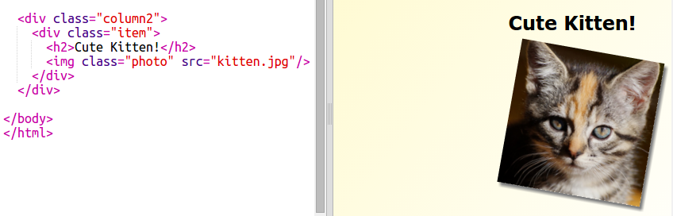
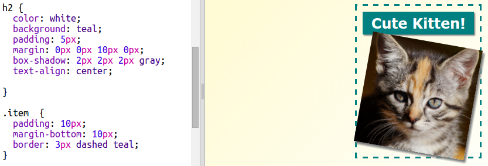

## ಸ್ಟೈಲ್ ಪತ್ರಿಕೆ ವಸ್ತುಗಳು

ವಿನ್ಯಾಸವನ್ನು ಸ್ವಲ್ಪ ಹೆಚ್ಚು ಆಸಕ್ತಿಕರಗೊಳಿಸೋಣ.

+ `div`ಅನ್ನು ` class` ನಿಮ್ಮ ಚಿತ್ರದ ಸುತ್ತಲೂ ಸೇರಿಸಿ ಮತ್ತು `h2` ಅನ್ನು ಶೀರ್ಷಿಕೆ ಸೇರಿಸಿ:
    
    

+ ಈಗ ಐಟಂ ಮತ್ತು ಶಿರೋನಾಮೆ ವಿನ್ಯಾಸ ಮಾಡಿ.
    
    ಇಲ್ಲಿ ಒಂದು ಉದಾಹರಣೆ ಇಲ್ಲಿದೆ, ಆದರೆ ನೀವು ಬದಲಾವಣೆಗಳನ್ನು ಮಾಡಬಹುದು:
    
    