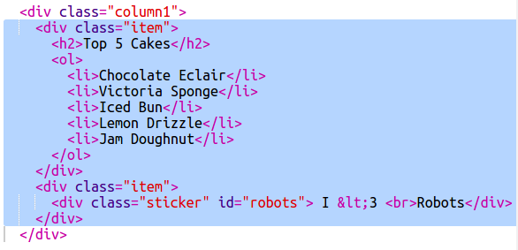

\--- challenge \---

## ಸವಾಲು: ವಸ್ತುಗಳನ್ನು ಸಾಲಿನ ಎಡಭಾಗಕ್ಕೆ ಸೇರಿಸಿ

ಎಡ ಸಾಲಿಗೆ ನೀವು ಆದೇಶಿಸಿದ ಪಟ್ಟಿ ಮತ್ತು ಗ್ರೇಡಿಯಂಟ್ ಪಠ್ಯ ಸ್ಟಿಕ್ಕರ್ ಅನ್ನು ಸೇರಿಸಬಹುದೇ?

ಒಂದು ಉದಾಹರಣೆ ಇಲ್ಲಿದೆ:

ಇದು ಉದಾಹರಣೆಯ ಸಂಕೇತವಾಗಿದೆ, ಆದರೆ ನೀವು ಅದನ್ನು ಬದಲಾಯಿಸಬಹುದು ಅಥವಾ ನಿಮ್ಮದೇ ಆದೊಂದಿಗೆ ಬರಬಹುದು.

HTML:

CSS:

\--- /challenge \---