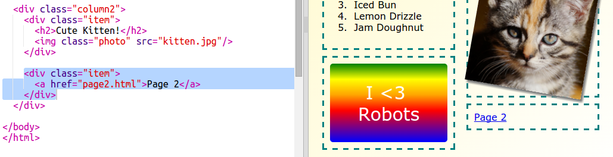

## ಎರಡನೇ ಪುಟವನ್ನು ಸೇರಿಸಿ

ನಿಮ್ಮ ಪತ್ರಿಕೆ ವೆಬ್‌ಸೈಟ್‌ಗೆ ಮತ್ತೊಂದು ಪುಟವನ್ನು ಸೇರಿಸೋಣ.

+ ನಿಮ್ಮ ಯೋಜನೆಗೆ ಹೊಸ ಪುಟವನ್ನು ಸೇರಿಸಿ ಮತ್ತು ಅದಕ್ಕೆ `page2.html`:ಎಂದು ಹೆಸರಿಸಿ:

+ ಪುಟ 2 ನಿಮ್ಮ ನಿಯತಕಾಲಿಕದ ಮೊದಲ ಪುಟಕ್ಕೆ ಹೋಲುತ್ತದೆ ಆದ್ದರಿಂದ ನೀವು Html ಅನ್ನು `index.html` ನಿಂದ ನಕಲಿಸಬಹುದು ಮತ್ತು ಅದನ್ನು `page2.html` ಗೆ ಅಂಟಿಸಿ.

ಎರಡೂ ಪುಟಗಳು ಒಂದೇ `style.css` ಅನ್ನು ಬಳಸುತ್ತವೆ ಎಂಬುದನ್ನು ಗಮನಿಸಿ ಆದ್ದರಿಂದ ಅವರು ಶೈಲಿಗಳನ್ನು ಹಂಚಿಕೊಳ್ಳುತ್ತಾರೆ.

+ ಪುಟ 2 ಗಾಗಿ `<h1>` ಶೀರ್ಷಿಕೆಯನ್ನು ಬದಲಾಯಿಸಿ:

+ ಈಗ ನಿಮಗೆ ನಿಮ್ಮ ಪುಟಗಳ ನಡುವೆ ಲಿಂಕ್‌ಗಳು ಬೇಕಾಗುತ್ತವೆ ಆದ್ದರಿಂದ ನೀವು ಪುಟ 2 ಕ್ಕೆ ಮತ್ತು ಮೊದಲ ಪುಟಕ್ಕೆ ಹಿಂತಿರುಗಬಹುದು.

`index.html` ಗೆ ಹಿಂತಿರು`index.html`:ನಲ್ಲಿ ಕಾಲಮ್ 2 ರಲ್ಲಿನ ಡಿವ್ ಒಳಗೆ ಲಿಂಕ್ ಸೇರಿಸಿ:

+ ನಿಮ್ಮ ಹೊಸ ಲಿಂಕ್ ಅನ್ನು ನೀವು ಕ್ಲಿಕ್ ಮಾಡಬಹುದು ಮತ್ತು ನಿಮ್ಮ ನಿಯತಕಾಲಿಕದ 2 ನೇ ಪುಟಕ್ಕೆ ಹೋಗಬಹುದ ಎಂದು ಪರೀಕ್ಷಿಸಿ.