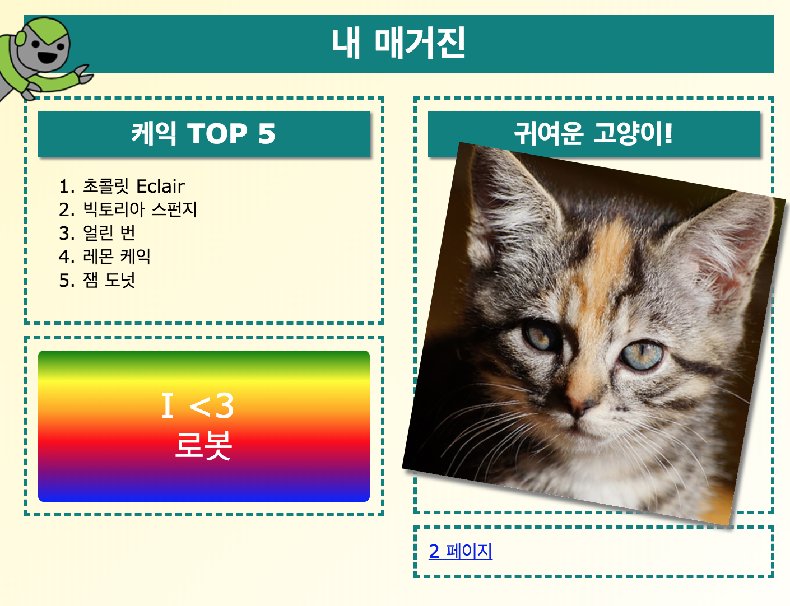

## 소개

이 프로젝트에서는 HTML과 CSS를 이용하여 여러 페이지의 매거진 웹사이트를 2페이지 레이아웃으로 제작하는 것을 목표로 합니다. 이 프로젝트를 잘 수행하기 위해서는 다른 프로젝트 페이지에서 배웠던 HTML과 CSS 테크닉을 많이 참조해야 합니다.

  <iframe src="https://trinket.io/embed/html/ef34c63db7?outputOnly=true&start=result" width="600" height="505" frameborder="0" marginwidth="0" marginheight="0" allowfullscreen>
  </iframe>
  

### 교육자들을 위한 추가 정보

이 프로젝트를 인쇄하려면 [프린트용 문서](https://projects.raspberrypi.org/ko-KR/projects/magazine/print)를 사용하십시오.

--- collapse ---
---
title: 교육자 노트
---
## 소개

이 프로젝트에서 학생들은 웹사이트를 2페이지 레이아웃을 제작하는 것을 배웁니다. 또한, 다른 프로젝트에서 배웠던 HTML과 CSS 지식을 복습할것입니다.

## 온라인 자료들

이 자료에서는 HTML과 CSS를 온라인으로 작성 가능한 [trinket](https://trinket.io/)을 사용하는 것을 권장합니다. 이 프로젝트는 아래와 같은 Trinket을 사용합니다:

* ['매거진' 프로젝트 파일 -- jumpto.cc/web-magazine](http://jumpto.cc/web-magazine)

학생들은 새로운 Trinket을 사용할 수 있으며 [(jumpto.cc/html-black)](http://jumpto.cc/html-blank) 이를 통해 자신만의 HTML과 CSS 코드를 사용하는 방법을 배울 수 있습니다. 또한, 템플릿이 제공된 Trinket을 사용할 수 있습니다. [(jumpto.cc/html-template)](http://jumpto.cc/html-template)

프로젝트의 샘플 정답이 다음 Trinket에 있습니다.

* ['매거진' 프로젝트 완성본 -- trinket.io/html/ef34c63db7](https://trinket.io/html/ef34c63db7)

## 오프라인 자료

프로젝트를 [오프라인에서 완성](https://www.codeclubprojects.org/en-GB/resources/webdev-working-offline/)할 수도 있습니다. 'Project Materials' 라는 링크를 클릭하여 이 프로젝트의 자료를 확인해볼 수 있습니다. 이 링크에는 학생들이 프로젝트를 오프라인으로 완료하는 데 필요한 자료가 포함된 'Project Resource' 섹션이 있습니다. 학생들이 자료의 사본에 접근할 수 있는지 확인하십시오. 이 섹션에는 아래와 같은 파일들이 포함되어 있습니다.

* intro/index.html
* template/template.html
* template/style.css
* magazine/index.html
* magazine/style.css
* magazine/script.js
* magazine/mutliple .png images

이 프로젝트의 완성된 버전은 'Volunteer Resources' 섹션에서 찾을 수 있습니다. 다음 파일이 있습니다:

* magazine-finished/index.html
* magazine-finished/style.css
* magazine-finished/script.js
* magazine-finished/kitten.jpg
* magazine-finished/recipe-finished.jpg
* magazine-finished/greenrobot.png
* magazine-finished/spacerobot.png

(또한 위의 모든 자료는 프로젝트 및 자원봉사자 `.zip` 파일로 다운로드 할 수 있습니다.)

## 학습 목표

* 이 프로젝트는 학생들이 2단 페이지 레이아웃을 `float:`을 통해 제작하는 방법을 배웁니다. 다른 프로젝트에 자세히 설명되어있는 HTML & CSS 테크닉도 복습할 수 있습니다. 주어진 예시가 있기 때문에 꼭 이전 프로젝트의 일부분을 완성하지 않아도, 학생들은 이 프로젝트를 완수할 수 있습니다. 

이 프로젝트는 [라즈베리파이 디지털 메이킹 커리큘럼](http://rpf.io/curriculum) 중 아래의 과정에 있는 요소들을 다룹니다.

* [2D와 3D 디자인](https://www.raspberrypi.org/curriculum/design/creator)

## 도전과제

* "왼쪽 열에 항목 배치" - 아이템을 "float" 속성이 있는 열 집합에 삽입
* "첫 번째 페이지에 링크 삽입"- 프로젝트의 페이지 사이의 링크를 만듭니다.
* "두 번째 페이지 내용 채우기" - HTML과 CSS를 복습합니다.
* "애니메이션 추가하기" - 애니메이션을 복습합니다.

--- /collapse ---

--- collapse ---
---
title: 프로젝트 자료
---
## 프로젝트 리소스

* [프로젝트의 모든 리소스가 들어있는 .zip 파일](resources/magazine-project-resources.zip)
* [매거진 프로젝트 자료가 포함된 온라인 Trinket](http://jumpto.cc/web-magazine)
* [온라인 Trinket 템플릿](http://jumpto.cc/trinket-template)
* [빈 Trinket](http://jumpto.cc/trinket-blank)
* [template/index.html](resources/template-index.html)
* [template/style.css](resources/template-style.css)
* [intro/index.html](resources/intro-index.html)
* [intro/style.css](resources/intro-style.css)
* [magazine/index.html](resources/magazine-index.html)
* [magazine/style.css](resources/magazine-style.css)
* [magazine/script.js](resources/magazine-script.js)
* [magazine/kitten.jpg](resources/magazine-kitten.jpg)
* [magazine/recipe-final.png](resources/magazine-recipe-final.png)
* [magazine/greenrobot.png](resources/magazine-greenrobot.png)
* [magazine/firerobot.png](resources/magazine-firerobot.png)
* [magazine/spacerobot.png](resources/magazine-spacerobot.png)
* [magazine/dogrobot.png](resources/magazine-dogrobot.png)

## 교육자를 위한 자료

* [완성된 모든 프로젝트 리소스가 들어있는 .zip 파일](resources/magazine-volunteer-resources.zip)
* [완성된 온라인 Trinket 프로젝트](https://trinket.io/html/ef34c63db7)
* [magazine-finished/index.html](resources/magazine-finished-index.html)
* [magazine-finished/style.css](resources/magazine-finished-style.css)
* [magazine-finished/script.js](resources/magazine-finished-script.js)
* [magazine-finished/kitten.jpg](resources/magazine-finished-kitten.jpg)
* [magazine-finished/recipe-final.png](resources/magazine-finished-recipe-final.png)
* [magazine-finished/greenrobot.png](resources/magazine-finished-greenrobot.png)
* [magazine-finished/spacerobot.png](resources/magazine-finished-spacerobot.png)

--- /collapse ---