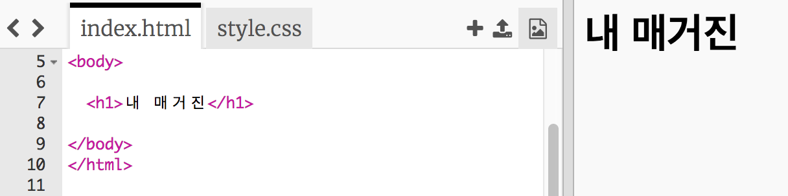
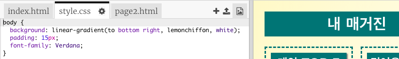

## 제목과 배경

잡지 스타일의 웹 사이트는 종종 페이지에 작은 아이템들이 많이 있습니다. 우선 잡지의 제목과 배경을 만들어봅시다.

+ Trinket 파일 열기: <a href="http://jumpto.cc/web-magazine" target="_blank">jumpto.cc/web-magazine</a>
    
    프로젝트는 아래와 같이 보일 것입니다:
    
    

+ 헤딩을 추가해 봅시다.
    
    잡지에 쓸 더 나은 제목을 생각해 봅시다.
    
    

+ 제목을 스타일링할 수 있나요?
    
    아래에 보이는 그림은 예시입니다. 자신만의 스타일을 선택할 수 있습니다.
    
    

+ 이제 흥미로운 배경을 만들어 봅시다! 적절한 그라데이션과 폰트를 선택하면 됩니다.
    
    그라데이션을 만드는 방법을 익히기 좋은 스타일의 몇 가지 예를 보여줍니다.
    
    