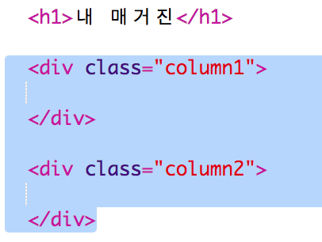
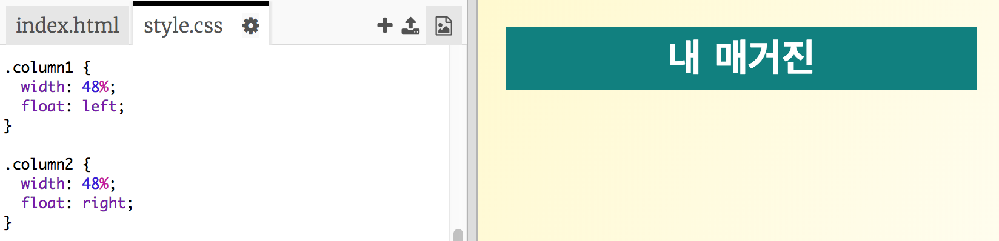
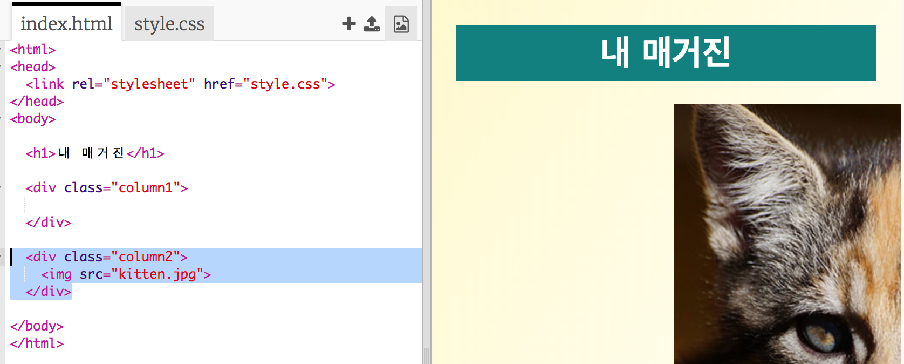
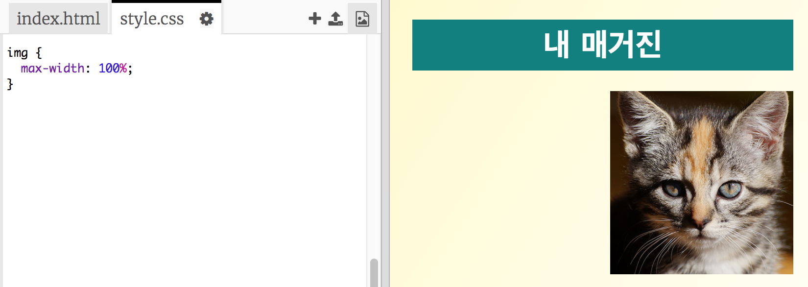
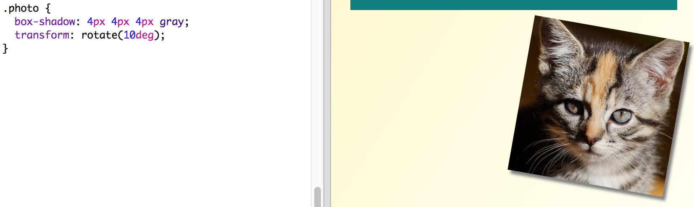

## 문단 만들기

웹사이트들은 여러 문단으로 이루어져 있습니다. 2단 레이아웃을 만들어봅시다.

+ 먼저, 문단`div` 2개를 만듭니다.
    
    아래와 같은 HTML 코드를 `index.html` 에 추가합니다.
    
    

+ 하나(column1)는 왼쪽에서 조금 떨어지게 하고 다른 하나(column2)는 오른쪽에서 조금 떨어지도록 열 div를 스타일합니다.
    
    
    
    각 단은 50%보다 작아서 패딩을 넣을 공간이 있습니다.
    
    위에서 수행한 작업을 확인하기 위해서는 무언가를 넣어서 확인해 봐야 하는데요,

+ 고양이 사진을 column 2에 넣어 봅시다.
    
    
    
    고양이의 이미지는 두 번째 단 중간쯤에 배치되어 있습니다.
    
    너무 크죠!

+ `max-width:`을 사용하여 이미지가 영역 내에 들어가도록 해 보겠습니다.
    
    다음을`style.css` 파일에 추가해보세요.
    
    
    
    이 코드는 고양이 사진 뿐만이 아니라 매거진에 추가되는 전체 이미지에 해당됩니다. 모든 이미지가 같은 사이즈로 나온다면, 뭔가 어색하겠죠?

+ 그래서 `photo`라는 클래스를 추가하여 스타일을 입히고자 하는 대상을 지정해 보겠습니다.
    
    

+ 그림자와 회전을 추가해서 더 잘 보이게 스타일링 해보세요.
    
    
    
    마음에 들때까지 계속 바꿔 보세요!