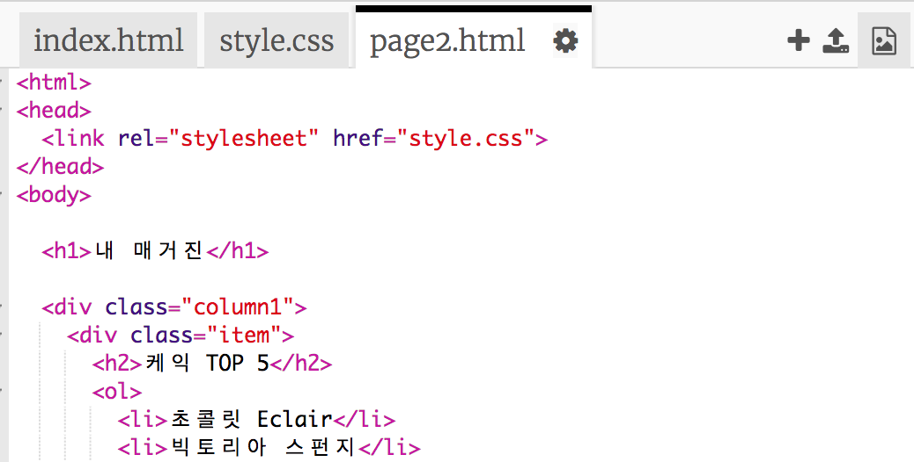
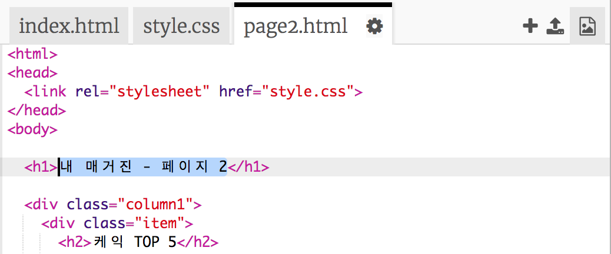
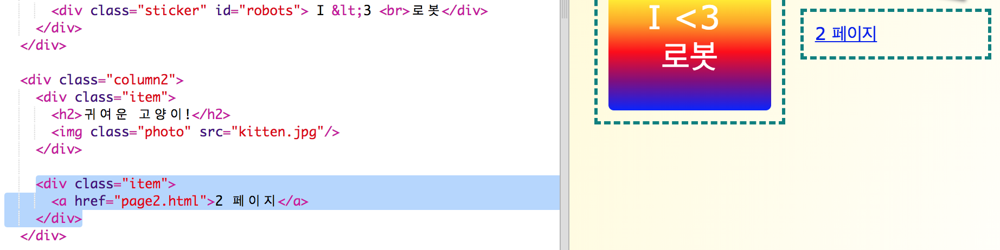

## 두 번째 페이지 추가

이번에는 매거진 웹사이트에 다른 페이지를 추가해 봅시다.

+ 새로운 페이지를 추가하고 `page2.html`라고 이름을 붙여보세요.

+ 두번째 페이지는 첫번째 페이지와 비슷하기 때문에 `index.html` 파일을 복사해서 `page2.html`에 붙여넣어도 됩니다.

두 페이지 다 똑같은 `style.css`을 사용한다는 점에 유의하세요.

+ `<h1>` 에 있는 제목을 변경해보세요.

+ 두 페이지를 서로 이동할 수 있도록 연결 하이퍼링크를 추가해야 합니다.

`index.html` 파일로 돌아가서 두번째 단에 새로운 div를 만들어서 링크를 삽입합니다.

+ 페이지 1에서 페이지 2로 이동할 수 있는지 테스트 해보세요.