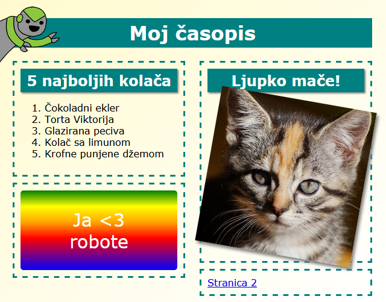

## Introduction

In this project, you'll learn how to use HTML and CSS to create a multi-page magazine website with a two page layout. You'll also revisit lots of HTML and CSS techiques from other projects.

  <iframe src="https://trinket.io/embed/html/a41e4e1c5c?outputOnly=true&start=result" width="600" height="505" frameborder="0" marginwidth="0" marginheight="0" allowfullscreen>
  </iframe>
  

### Additional information for club leaders

If you need to print this project, please use the [Printer friendly version](https://projects.raspberrypi.org/en/projects/magazine/print).

## \--- collapse \---

## title: Club leader notes

## Introduction

In this project, children will learn how to create a two-column layout. They will also recap lots of the HTML & CSS that they have learned in other projects.

## Online Resources

We recommend using [trinket](https://trinket.io/) to write HTML & CSS online. This project contains the following trinkets:

* ['Magazine' starting point -- jumpto.cc/web-magazine](http://jumpto.cc/web-magazine)

Children can also make use of this blank trinket [(jumpto.cc/html-blank)](http://jumpto.cc/html-blank) to write their own HTML & CSS, or alternatively they can use this template trinket [(jumpto.cc/html-template)](http://jumpto.cc/html-template).

There is also a trinket containing a sample solution to the challenges:

* ['Magazine' Finished -- trinket.io/html/a41e4e1c5c](https://trinket.io/html/a41e4e1c5c)

## Offline Resources

This project can be [completed offline](https://www.codeclubprojects.org/en-GB/resources/webdev-working-offline/) if preferred. You can access the project resources by clicking the 'Project Materials' link for this project. This link contains a 'Project Resources' section, which includes resources that children will need to complete this project offline. Make sure that each child has access to a copy of these resources. This section includes the following files:

* intro/index.html
* template/template.html
* template/style.css
* magazine/index.html
* magazine/style.css
* magazine/script.js
* magazine/mutliple .png images

You can also find a completed version of this project's challenges in the 'Volunteer Resources' section, which contains:

* magazine-finished/index.html
* magazine-finished/style.css
* magazine-finished/script.js
* magazine-finished/kitten.jpg
* magazine-finished/recipe-finished.jpg
* magazine-finished/greenrobot.png
* magazine-finished/spacerobot.png

(All of the resources above are also downloadable as project and volunteer `.zip` files.)

## Learning Objectives

* This project teaches children how to create a two-column magazine style layout using `float:`. It also recaps lots of the HTML & CSS that is covered in more detail in other projects. Examples are given so children will be able to complete this project even if they have not completed some of the earlier projects. 

This project covers elements from the following strands of the [Raspberry Pi Digital Making Curriculum](http://rpf.io/curriculum):

* [Design basic 2D and 3D assets](https://www.raspberrypi.org/curriculum/design/creator).

## Challenges

* "Add items to the left column" - placing items inside a floated element;
* "Add a link back to the first page" - creating links between pages in a project;
* "Fill in your second page" - recapping more HTML & CSS;
* "Add another animation" - recapping animations.

\--- /collapse \---

## \--- collapse \---

## title: Project materials

## Project resources

* [.zip file containing all project resources](https://rpf.io/p/en/magazine-go)
* [Online Trinket containing all 'Magazine' project resources](http://jumpto.cc/web-magazine)
* [Online Trinket template](http://jumpto.cc/trinket-template)
* [Online blank Trinket](http://jumpto.cc/trinket-blank)
* [template/index.html](resources/template-index.html)
* [template/style.css](resources/template-style.css)
* [intro/index.html](resources/intro-index.html)
* [intro/style.css](resources/intro-style.css)
* [magazine/index.html](resources/magazine-index.html)
* [magazine/style.css](resources/magazine-style.css)
* [magazine/script.js](resources/magazine-script.js)
* [magazine/kitten.jpg](resources/magazine-kitten.jpg)
* [magazine/recipe-final.png](resources/magazine-recipe-final.png)
* [magazine/greenrobot.png](resources/magazine-greenrobot.png)
* [magazine/firerobot.png](resources/magazine-firerobot.png)
* [magazine/spacerobot.png](resources/magazine-spacerobot.png)
* [magazine/dogrobot.png](resources/magazine-dogrobot.png)

## Club leader resources

* [.zip file containing all completed project resources](https://rpf.io/p/en/magazine-go)
* [Online completed Trinket project](https://trinket.io/html/a41e4e1c5c)
* [magazine-finished/index.html](resources/magazine-finished-index.html)
* [magazine-finished/style.css](resources/magazine-finished-style.css)
* [magazine-finished/script.js](resources/magazine-finished-script.js)
* [magazine-finished/kitten.jpg](resources/magazine-finished-kitten.jpg)
* [magazine-finished/recipe-final.png](resources/magazine-finished-recipe-final.png)
* [magazine-finished/greenrobot.png](resources/magazine-finished-greenrobot.png)
* [magazine-finished/spacerobot.png](resources/magazine-finished-spacerobot.png)

\--- /collapse \---