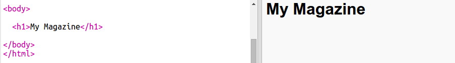
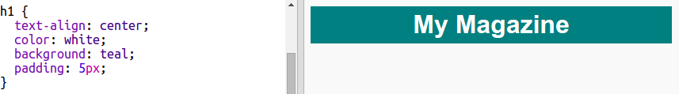

## Naslov i pozadina

Veb-sajtovi u stilu časopisa često imaju mnogo sitnih elemenata na stranici. Prvo ćeš kreirati naslov i pozadinu za svoj časopis.

+ Otvori sljedeći trinket: <a href="http://trinket.io/html/1fee100d34" target="_blank">trinket.io/html/1fee100d34</a>.
    
    Projekat treba da izgleda ovako:
    
    

+ Dodajmo naslov.
    
    Možeš da smisliš bolji naziv za svoj časopis.
    
    

+ Da li možeš da stilizuješ naslov?
    
    Evo primjera, ali možeš da odabereš i sopstveni stil:
    
    

+ Napravimo sada zanimljivu pozadinu koristeći gradijent i odaberimo font za časopis.
    
    Ovdje je primjer stila kao podsjetnik o tome kako se kreira gradijent:
    
    