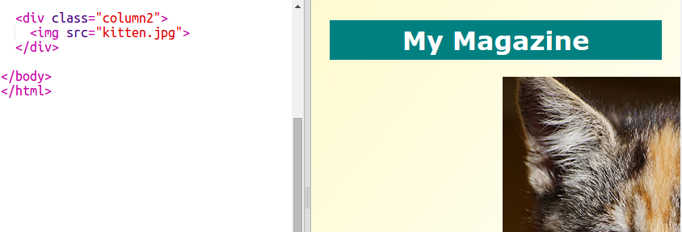

## Kreiranje kolona

Na veb-sajtovima često se koristi više kolona. Napravimo raspored u dvije kolone za tvoj časopis.

+ Prvo kreiraj dva `div` za kolone.
    
    Dodaj označeni HTML u `index.html`:
    
    

+ Sada stilizuj oba div za kolone tako da jedna pluta ulijevo, a druga udesno.
    
    
    
    Svaka kolona zauzima manje od 50%, tako da ima prostora za popunu.
    
    Biće potrebno da nešto dodaš u kolonu da bismo vidjeli rezultat.

+ Dodajmo sliku mačeta na vrh kolone 2.
    
    
    
    Obrati pažnju na to da je slika mačeta postavljena otprilike na sredini stranice, u drugoj koloni.
    
    Izgleda, ipak, da je slika veća nego što bi trebalo!

+ Upotrijebimo `max-width:` kako bi se slike uklopile u svoj kontejner.
    
    Dodaj sljedeći stil u `style.css`.
    
    
    
    Ovaj stil će se primijenjivati na sve slike koje koristiš u svom časopisu, ne samo na sliku mačeta.

+ Sada slici dodaj klasu `photo` kako bismo mogli da je stilizujemo:
    
    

+ Stilizuj sliku tako što ćeš dodati sjenku (shadow) i okrenuti je tako da izgleda kao da fotografija izlazi sa stranice:
    
    
    
    Pravi izmjene sve dok ti se ne svidi rezultat.