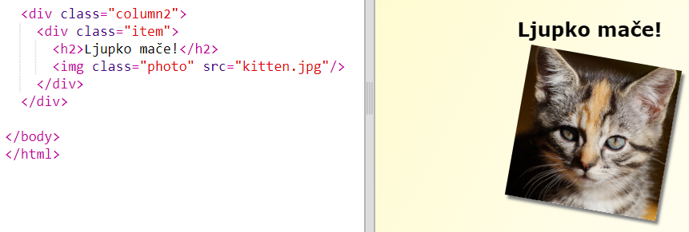

## Stilizuj objekte časopisa

Napravimo izgled stranice malo zanimljivijim.

+ Dodaj `div` sa `class` oko svoje slike i dodaj `h2` naslov:
    
    

+ Sada stilizuj objekat (item) i naslov.
    
    Evo primjera koji možeš izmijeniti ako želiš:
    
    