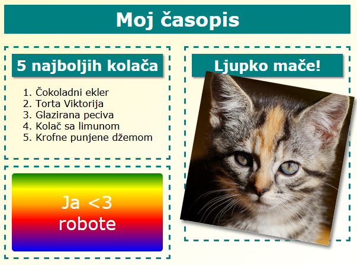
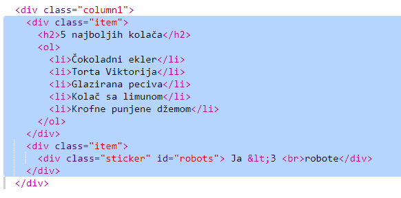
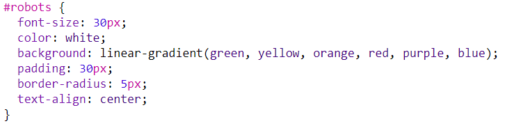

\--- challenge \---

## Izazov: Dodaj objekte u lijevu kolonu

Možeš li da dodaš uređenu listu i naljepnicu sa tekstom i gradijentom u lijevu kolonu?

Evo primjera:

Ovo je kôd za prikazani primjer, a ti možeš da ga izmijeniš ili da napišeš sopstveni kôd.

HTML:

CSS:

\--- /challenge \---