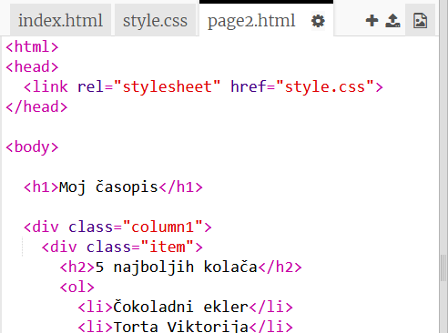
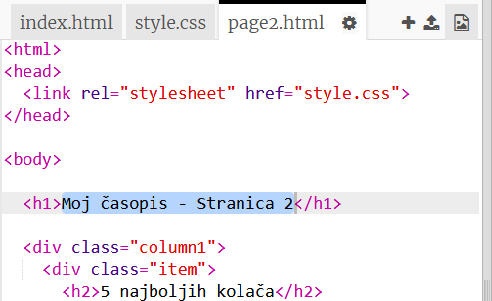
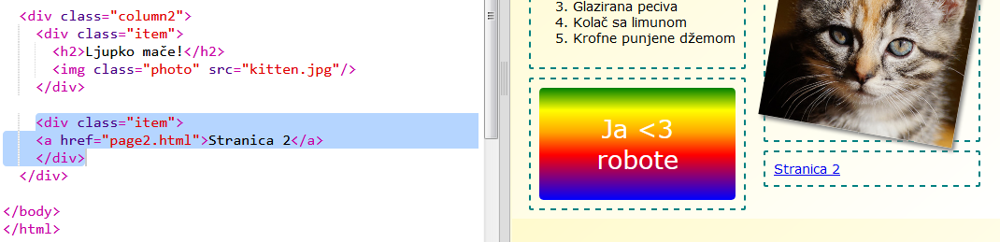

## Dodaj drugu stranicu

Dodajmo još jednu stranicu na veb-sajt tvog časopisa.

+ Dodaj novu stranicu u svoj projekat i nazovi je `page2.html`:

+ Stranica 2 biće dosta slična prvoj stranici tvog časopisa, tako da možeš da kopiraš html iz `index.html` i preneseš ga u `page2.html`.

Imaj u vidu da obje stranice koriste isti `style.css`, tako da će dijeliti iste stilove.

+ Izmijeni naslov `<h1>` za stranicu 2:

+ Sada će nam biti potrebni linkovi između stranica kako bismo mogli da idemo na stranicu 2 i da se vratimo na naslovnu stranicu.

Vrati se na `index.html`. Dodaj link unutar div u stupcu 2 u `index.html`:

+ Isprobaj da li možeš da klikneš na novi link i pređeš na stranicu 2 tvog časopisa.