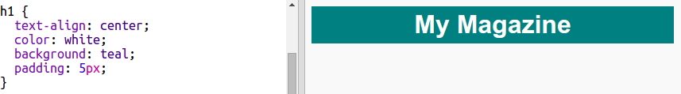
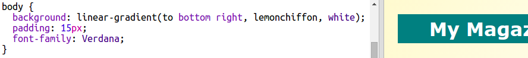

## शीर्षक आणि पार्श्वभूमी

मॅगझिन -स्टाइलच्या वेबसाइटवर बर्‍याचदा पृष्ठावर बर्‍याच लहान वस्तू असतात. प्रथम आपण आपल्या मॅगझिनसाठी शीर्षक आणि पार्श्वभूमी तयार करणार आहात.

+ हे trinket उघडा: <a href="http://jumpto.cc/web-magazine" target="_blank">jumpto.cc/web-magazine</a>.
    
    प्रकल्प असा दिसायला हवा:
    
    

+ हेडिंग(शीर्षक) जोडू.
    
    आपण आपल्या मॅगझिनसाठी एक उत्कृष्ट शीर्षक विचार करू शकता.
    
    

+ आपण शीर्षकला स्टाइल करू शकता?
    
    येथे एक उदाहरण आहे, परंतु आपण आपली स्वतःची स्टाइल निवडू शकता:
    
    

+ आता ग्रेडीयंट वापरुन एक रुचीपूर्ण पार्श्वभूमी तयार करू आणि मॅगझिनसाठी एक फॉन्ट निवडा.
    
    ग्रेडियंट कसे तयार करावे याची आठवण म्हणून येथे काही उदाहरण आहे:
    
    