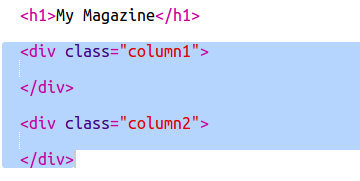
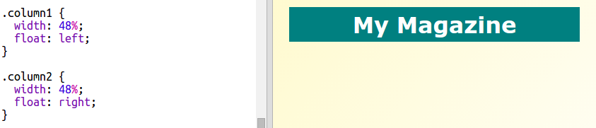

## स्तंभ तयार करीत आहे

वेबसाइट्स बर्‍याचदा अनेक कॉलम वापरतात. आपल्या मॅगझिनसाठी दोन स्तंभ लेआउट तयार करूया.

+ प्रथम दोन स्तंभ `div`s तयार करा.
    
    `index.html` मध्ये हाइलाइट केलेले HTML जोडा:
    
    

+ आता स्तंभ डिव्हस स्टाईल करा जेणेकरून एक डावीकडे तर दुसरे उजवीकडे राहिल.
    
    
    
    प्रत्येक स्तंभ 50% पेक्षा कमी आहे म्हणून पॅडिंगसाठी जागा आहे.
    
    प्रभाव पाहण्यासाठी आपल्याला स्तंभात काहीतरी जोडण्याची आवश्यकता आहे.

+ स्तंभ 2 च्या शीर्षस्थानी एक मांजरीचे पिल्लू चित्र जोडू.
    
    
    
    लक्ष द्या की मांजरीचे पिल्लू दुसर्‍या स्तंभात पेजच्या अर्ध्या दिशेने उभे आहे.
    
    हे थोडे मोठे आहे!

+ प्रतिमा त्यांच्या कंटेनरमध्ये फिट करण्यासाठी `max-width:` वापरा.
    
    खालील कोड `style.css` मध्ये जोडा.
    
    
    
    हे आपण आपल्या मासिकामध्ये वापरत असलेल्या सर्व प्रतिमा लागू होईल, फक्त मांजरीचे पिल्लू नव्हे.

+ आता एक वर्ग जोडा `photo` प्रतिमेवर जेणेकरून आपण त्यास स्टाइल देऊ शकाल:
    
    

+ आणि पेजमधुन छायाचित्र पॉप आउट करण्यासाठी छाया आणि एक पिळ जोडण्यासाठी प्रतिमेस स्टाइल द्या:
    
    
    
    जोपर्यंत आपल्याला निकाल आवडत नाही तोपर्यंत काही बदल करा.